# 第4章 虚拟机性能监控、故障处理工具

## 4.1 概述
- 给一个系统定位问题的时候，知识、经验是关键基础，数据是依据，工具是运用知识处理数据的手段。这里说的数据包括但不限于异常堆栈、虚拟机运行日志、
垃圾收集器日志、线程快照（threaddump/javacore文件）、堆转储快照（heapdump/hrof文件）等。恰当地使用虚拟机故障处理、分析的工具可以提升我们分析数据、
定位并解决问题的效率。

## 4.2 基础故障处理工具
- 在JDK的bin目录下有各种小工具，这些主要是用于监视虚拟机运行状态和进行故障处理的工具，根据软件可用性和授权不同，可以把它们划分为三类：
  - 商业授权工具：主要是JMC（Java Mission Control）及它要使用到的JFR（Java Flight Recorder）。
  - 正式支持工具：这一类是属于被长期支持的工具。
  - 实验性工具：这一类工具在它们使用说明中被声明为"没有技术支持，并且是实验性质的"产品，日后可能会转正，也可能会在某个JDK版本中无声无息地消失。
  但事实上它们通常都非常稳定而且功能强大，也能在处理应用程序性能问题、定位故障时发挥很大作用。
  
### 4.2.1 jps：虚拟机进程状况工具
- jps:可以列出正在运行的虚拟机进程，并显示虚拟机执行主类（Main Class，main()函数所在的类）名称以及这些进程的本地虚拟机唯一ID（LVMID，
Local Virtual Machine Identifier）。
- jps命令格式
```text
jps [ options ] [ hostid ]
```
jps执行样例
jps -l
```text
jps -l                                                                                                                                                                                                                                
1177 org.jetbrains.idea.maven.server.RemoteMavenServer36
1481 jdk.jcmd/sun.tools.jps.Jps
1147 
```
- jps还可以通过RMI协议查询开启了RMI服务的远程虚拟机进程状态，参数hostid为RMI注册表中注册的主机名。


### 4.2.2 jstat：虚拟机统计信息监视工具
- jstat(JVM Statistics Monitoring Tool)是用于监视虚拟机各种运行状态信息的命令行工具。它可以显示本地或者远程虚拟机进程中的类加载、内存、
垃圾收集、即时编译等运行时数据，在没有GUI图形界面、只提供了纯文本控制台环境的服务器上，它将是运行期定位虚拟机性能问题的常用工具。
- jstat命令格式为：
```text
jstat [ option vmid [interval[s|ms] [count]] ]
```
- 对于命令格式中的VMID与LVMID需要特别说明一下：如果是本地虚拟机进程，VMID与LVMID是一致的；如果是远程虚拟机进程，那VMID的格式应当是：
```text
[protocol:][//]lvmid[@hostname[:port]/servername]
```
- 参数interval和count代表查询间隔和次数，如果省略这2个参数，说明只查询一次。假设需要每250毫秒查询一次进程2764垃圾收集情况，一共查询20次，
那命令应当是：
```text
jstat -gc 2764 250 20
```
- 选项option代表用户希望查询的虚拟机信息，主要分为三类：类加载、垃圾收集、运行期编译状况。
- jstat执行样例
```text
jstat -gcutil 7304
  S0     S1     E      O      M     CCS    YGC     YGCT    FGC    FGCT    CGC    CGCT     GCT   
  0.00  44.06  39.52  70.35  93.62  88.93    103    0.644    12    0.322     -        -    0.966
```
- 查询结果表明：该进程的新生代Eden（E，表示Eden）使用了39.52%的空间，2个Survivor区（S0、S1，表示Survivor0、Survivor1）分别使用了0和44.06%的空间。
老年代（O，表示 Old）使用了70.35%的空间。程序运行以来共发生Minor GC（YGC，表示Yong GC）16次，总耗时0.644秒；发生Full GC（FGC，表示Full GC）12次，
总耗时（FGCT，表示Full GC Time）为0.322秒；所有GC总耗时（GCT，表示 GC Time）为0.966秒。


### 4.2.3 jinfo：Java配置信息工具 
- jinfo（Configuration Info for Java）的作用是实时查看和调整虚拟机各项参数。jinfo的-flag选项可以查看虚拟机启动时未被显式指定的参数的系统默认值。
jinfo还可以使用-sysprops选项把虚拟机进程的System.getProperties()的内容打印出来。
- jinfo命令格式：
```text
jinfo [ option ] pid
```
- 执行样例：查询CMSInitiatingOccupancyFraction参数值
```text
jinfo -flag CMSInitiatingOccupancyFraction 7304
-XX:CMSInitiatingOccupancyFraction=-1
```

### 4.2.4 jmap：Java内存映像工具
- jmap（Memory Map for Java）命令用于生成堆转储快照（一般称为heapdump或dump文件）。jmap还可以查询finalize执行队列、Java堆和方法区的详细信息，
如空间使用率、当前用的是哪种收集器等。
- jmap命令格式：
```text
jmap [ option ] vmid
```
- 执行样例：
```text
jmap -dump:format=b,file=idea.bin 7304                                                                                                                                                                       [2d5h7m] ✹ ✭
Heap dump file created
```


### 4.2.5 jhat：虚拟机堆转储快照分析工具
- JDK提供jhat（JVM Heap Analysis Tool）命令与jmap搭配使用，来分析jmap生成的堆转储快照。jhat内置了一个微型的HTTP/Web服务器，
生成的堆转储快照的分析结果后，可以在浏览器查看。
- 使用jhat分析dump文件
```text
jhat idea.bin
Reading from idea.bin...
Dump file created Mon Mar 23 23:39:03 CST 2020
Snapshot read, resolving...
Resolving 2817601 objects...
Chasing references, expect 563 dots......
Eliminating duplicate references.......
Snapshot resolved.
Started HTTP server on port 7000
Server is ready.
```
- 屏幕显示"Server is ready."的提示后，用户在浏览器中输出http://localhost:7000/可以看到分析结果。


### 4.2.6 jstack：Java堆栈跟踪工具
- jstack（Stack Trace for Java）命令用于生成虚拟机当前时刻的线程快照（一般称为threaddump或者javacore文件）。
线程快照就是当前虚拟机内每一条线程正在执行的方法堆栈的集合，生成线程快照的目的通常是定位线程出现长时间停顿的原因，如线程间死锁、死循环、
请求外部资源导致的长时间挂起等，都是导致线程长时间停顿的常见原因。线程出现停顿时通过jstack来查看各个线程的调用堆栈，
就可以获知没有响应的线程到底在后台做些什么事情，或者等待着什么资源。
- jstack命令格式：
```text
jstack [ option ] vmid
```
- 
- 代码清单4-4 使用jstack查看线程堆栈（部分结果）
```text
jstack -l 6275                                                              ⏎
2020-03-26 22:43:04
Full thread dump OpenJDK 64-Bit Server VM (25.152-b39 mixed mode):

"rebel-notifications-queue-1" #57 daemon prio=5 os_prio=31 tid=0x00007ff24a70a000 nid=0x959f waiting on condition [0x0000700009845000]
   java.lang.Thread.State: TIMED_WAITING (parking)
	at sun.misc.Unsafe.park(Native Method)
	- parking to wait for  <0x00000007a59095c0> (a java.util.concurrent.locks.AbstractQueuedSynchronizer$ConditionObject)
	at java.util.concurrent.locks.LockSupport.parkNanos(LockSupport.java:215)
	at java.util.concurrent.locks.AbstractQueuedSynchronizer$ConditionObject.awaitNanos(AbstractQueuedSynchronizer.java:2078)
	at java.util.concurrent.ScheduledThreadPoolExecutor$DelayedWorkQueue.take(ScheduledThreadPoolExecutor.java:1093)
	at java.util.concurrent.ScheduledThreadPoolExecutor$DelayedWorkQueue.take(ScheduledThreadPoolExecutor.java:809)
	at java.util.concurrent.ThreadPoolExecutor.getTask(ThreadPoolExecutor.java:1067)
	at java.util.concurrent.ThreadPoolExecutor.runWorker(ThreadPoolExecutor.java:1127)
	at java.util.concurrent.ThreadPoolExecutor$Worker.run(ThreadPoolExecutor.java:617)
	at java.lang.Thread.run(Thread.java:745)

   Locked ownable synchronizers:
	- None
```
- 从JDK5起，java.lang.Thread类新增了一个getAllStackTraces()方法用于获取虚拟机中所有线程的StackTraceElement对象。
使用这个方法可以通过简单的几行代码完成jstack的大部分功能，在实际项目中不妨调用这个方法做个管理员页面，可以随时使用浏览器来查看线程堆栈，
如代码清单4-5所示。
- 代码清单4-5 查看线程状况的JSP页面
```text
<%@ page import="java.util.Map"%>

<html>
<head>
    <title>服务器线程信息</title>
</head>
<body>
<pre>
    <%
        for (Map.Entry<Thread, StackTraceElement[]> stackTrace : Thread.getAllStackTraces().entrySet()) {
            Thread thread = (Thread) stackTrace.getKey();
            StackTraceElement[] stack = stackTrace.getValue();
            if (thread.equals(Thread.currentThread())) {
                continue;
            }
            out.print("\n线程："  + thread.getName() + "\n");
            for (StackTraceElement element : stack) {
                out.print("\t" + element + "\n");
            }
        }
    %>
</pre>
</body>
</html>
```

### 4.3.1 JHSDB：基于服务性代理的调试工具
- JHSDB是一款基于服务性代理实现的进程外调试工具。服务性代理是HotSpot虚拟机虚拟机中一组用于映射Java虚拟机运行信息的、主要基于Java语言（含少量JNI代码）实现的API集合。
服务性代理以HotSpot内部的数据结构为参照物进行设计，把这些C++的数据抽象出Java模型对象，相当于HotSpot的C++代码的一个镜像。
通过服务性代理的API，可以在一个独立的Java虚拟机的进程里分析其他HotSpot虚拟机的内部数据，或者从HotSpot虚拟机进程内存中dump出来的转储快照里还原出它的运行状态细节。
本次借助JHSDB来分析一下代码清单4-6中的代码，并通过实验来回答一个简单问题：staticObj、instanceObj、localObj这三个变量本身（而不是它们所指向的对象）存放在哪里？
- 代码清单4-6 JHSDB测试代码
```java
/**
 * staticObj、instanceObj、localObj存放在哪里？
 */
public class JHSDB_TestCase {

    static class Test {
        static ObjectHolder staticObj = new ObjectHolder();
        ObjectHolder instanceObj = new ObjectHolder();

        void foo() {
            ObjectHolder localObj = new ObjectHolder();
            System.out.println("done"); // 设置一个断点
        }
    }

    private static class ObjectHolder {}

    public static void main(String[] args) {
        Test test = new JHSDB_TestCase.Test();
        test.foo();
    }
}
```

- 通过前面两张学习的理论知识得出，staticObj随着Test的类型信息存放在方法区，instanceObj随着Test的对象实例存放在Java堆，
localObj则是存放在foo()方法栈帧的局部变量表中。现在通过JHSDB来实践验证这一点。
- 首先，要确保这三个变量已经在内存中分配好，然后将程序暂停下来，一遍有空隙进行实验，这只要把断电设置在代码中加粗的打印语句上，
然后在调试模式下运行程序即可。为了后续操作时可以加快在内存中搜索对象的速度，建议限制一下Java堆的大小。
本例中，采用的运行参数如下：
```text
-Xmx10m -XX:+UseSerialGC -XX:-UseCompressedOops
```
- 程序执行后通过jps查询到测试程序的进程ID，具体如下：
```text
 jps -l
2032 jdk.jcmd/sun.tools.jps.Jps
1492 org.jetbrains.idea.maven.server.RemoteMavenServer36
2022 org.jetbrains.jps.cmdline.Launcher
2023 ch3.JHSDB_TestCase
1471 
```
- 使用以下命令进入JHSDB的图形化模式，并使其附加进程2023：
```text
jhsdb hsdb --pid 2023
```
- 命令打开的JHSDB的界面如图4-4所示。

- 图4-4 JHSDB的界面

- 阅读代码清单4-6可知，运行至断点位置一共会创建三个ObjectHolder对象的实例，只要是对象实例必然会在Java堆中分配，从这三个对象开始着手，
先把它们从Java堆中找出来。
- 首先点击菜单中的Tools -> Heap Parameters，结果如图4-5所示，因为运行参数中指定了使用的是Serial收集器，图中我们看到了典型的Serial的分代内存布局，
Heap Parameters窗口中清楚列出了新生代的Eden、S1、S2和老年代的容量（单位为字节）以及它们的虚拟内存地址的起止范围。
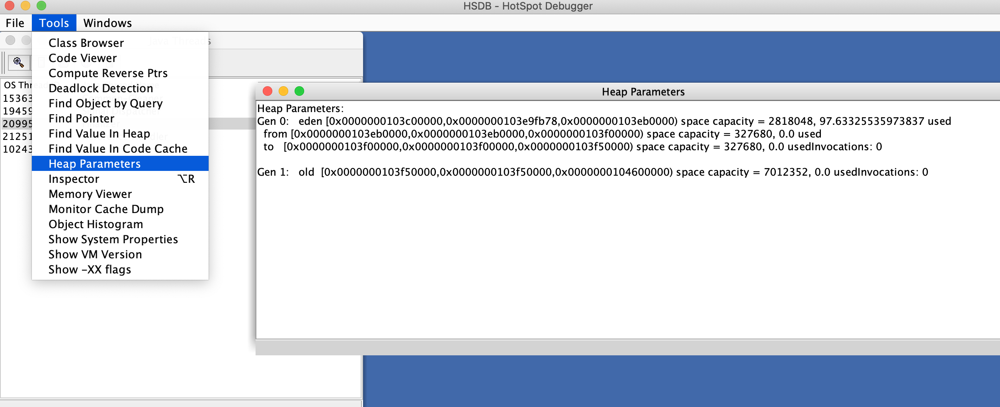
- 图4-5 Serial收集器的堆布局

- 注意图中各个区域的内容地址范围，后面还要用到它们。打开Windows -> Console 窗口，
使用scanoops命令在Java堆的新生代（从Eden起始地址到To Survivor结束地址）范围内查找ObjectHolder的实例，结果如下所示：
```text
hsdb>scanoops 0x0000000103c00000 0x0000000103f50000 JHSDB_TestCase$ObjectHolder
0x0000000103e97bb8 ch3/JHSDB_TestCase$ObjectHolder
0x0000000103e97be0 ch3/JHSDB_TestCase$ObjectHolder
0x0000000103e97bf0 ch3/JHSDB_TestCase$ObjectHolder
```
- 果然找到了三个实例的地址，而且它们的地址都落到了Eden的范围之内，算是顺带验证了一般情况下新对象在Eden中创建的分配规则。
再使用Tools -> Inspector功能确认一下这三个地址中存放的对象，结果如图4-6所示。
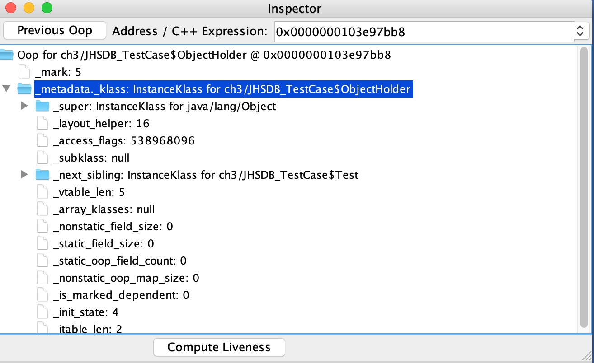
- 图4-6 查看对象实例数据

- Inspector展示了对象头和指向对象元数据的指针，里面包括了Java类型的名字、继承关系、实现接口关系，字段信息、方法信息、运行时常量池的指针、
内嵌的虚方法表（vtable）以及接口方法表（itable）等。
- 接下来要根据堆中对象实例地址找出引用它们的指针，使用如下命令：
```text
hsdb> revptrs 0x0000000103e97bb8
null
Oop for java/lang/Class @ 0x0000000103e96388
```
- 找到了一个引用该对象的地方，是在一个java.lang.Class的实例里，并且给出了这个实例的地址，通过Inspector查看该对象实例，
可以清楚看到这确实是一个java.lang.Class类型的对象实例，里面有一个名为staticObj的实例字段，如图4-7所示。
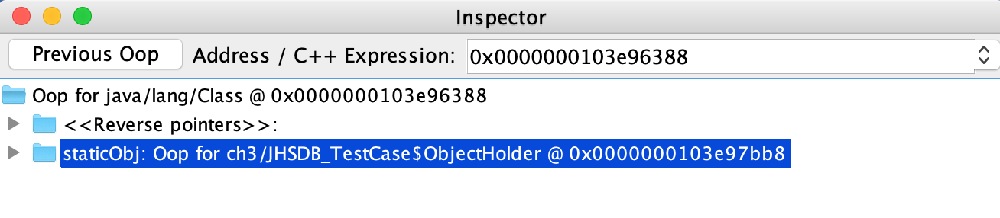
- 图4-7 Class对象

- 接下来继续查找第二个对象实例：
```text
hsdb> revptrs 0x0000000103e97be0
Oop for JHSDB_TestCase$Test @ 0x0000000103e97bc8
```
- 这次找到一个类型为JHSDB_TestCase$Test的对象实例，在Inspector中该对象实例显示如图4-8所示。
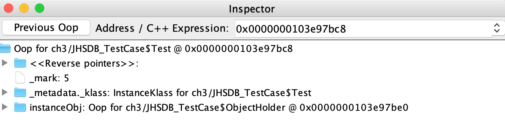
- 图4-8 JHSDB_TestCase$Test对象

- 这个结果完全符合预期，第二个ObjectHolder的指针是在Java堆中JHSDB_TestCase$Test对象的instanceObj字段上。
但是采用相同方法查找第三个ObjectHolder实例时，JHSDB返回了一个null，表示未查找到任何结果。
```text
hsdb> revptrs 0x0000000103e97bf0
null
```
- 看来revptrs命令并不支持查找栈上的指针引用，不过因为测试代码足够简洁，可以人工完成这件事情。
在Java Thread窗口中main线程后点击Stack Memory按钮查看该线程的内存，如图4-9所示。

- 图4-9 main线程的栈内存

- 这个线程只有两个方法栈帧，尽管没有查找功能，但通过肉眼观察在地址   上的值正好就是0x0000000103e97bf0，而且JHSDB在旁边已经自动生成注释，
说明这里确实是引用了一个来自新生代的JHSDB_TestCase$ObjectHolder对象。


### 4.3.2 JConsole:Java监视与管理控制台
- JConsole（Java Monitoring and  Management Console）是一款基于JMX（Java Management Extensions)的可视化监视、管理工具。
它的主要功能是通过JMX的MBean（Managed Bean）对系统进行信息收集和参数动态调整。

#### 1.启动JConsole
- 通过JDK/bin目录下的jconsole.exe启动JConsole后，会自动搜索出本机运行的所有虚拟机进程，而不需要自己使用jps来查询，如图4-10所示。
双击选择其中一个程序便可进入主界面开始监控。JMX支持跨服务器的管理，也可以使用下面的“远程进程”功能来连接远程服务器，对远程虚拟机进行监控。
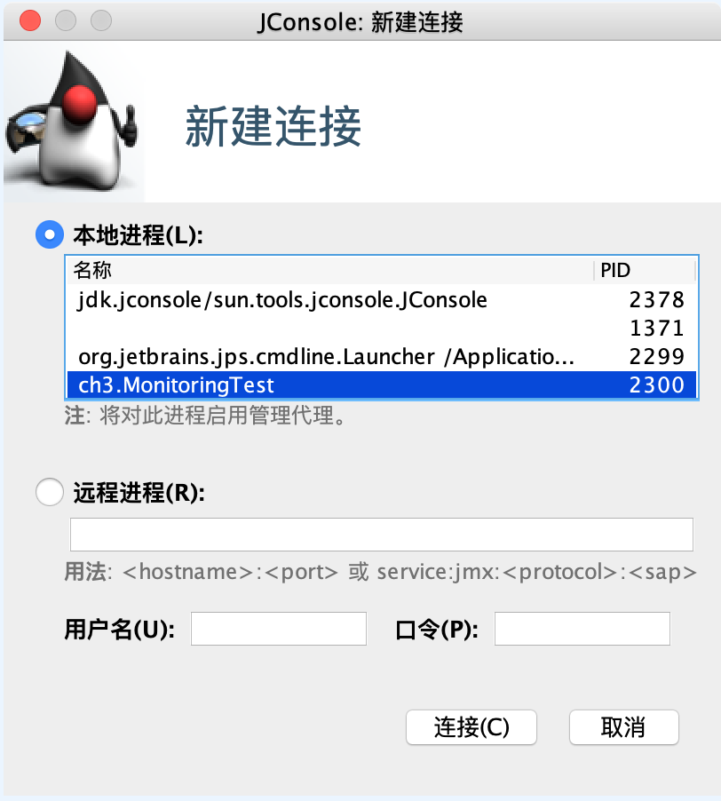
- 图4-10 JConsole连接页面

- 图4-10看到有三个本地虚拟机进程。双击MonitoringTest进入JConsole主界面，如图4-11所示。
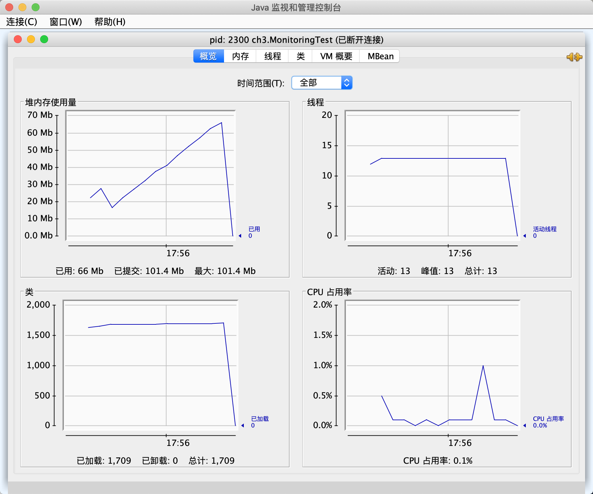
- 图4-11 JConsole主界面
#### 2.内存监控
- "内存"页签的作用相当于可视化的jstat命令，用于监视被收集器管理的虚拟机内存（被收集器直接管理的Java堆和被间接管理的方法区）的变化趋势。
我们通过运行代码清单4-7中的代码来体验一下它的监视功能。运行时设置的虚拟机参数为：
```text
-Xms100m -Xmx100m -XX:+UseSerialGC
```
- 代码清单4-7 JConsole监视代码
```java
/**
 * 内存占位符对象，一个OOMObject大约占64KB
 */
public class MonitoringTest {
    static class OOMObject {
        public byte[] placeholder = new byte[64 * 1024];
    }

    public static void fillHeap(int num) throws InterruptedException {
        List<OOMObject> list = new ArrayList<>();
        for (int i = 0; i < num; i++) {
            // 稍作延迟，令监视器的变化更加明显
            Thread.sleep(50);
            list.add(new OOMObject());
        }
        System.gc();
    }

    public static void main(String[] args) throws Exception {
        fillHeap(1000);
    }
}
```

- 这段代码的作用是以64KB/50ms的速度向Java堆中填充数据，一共填充1000次，使用JConsole的“内存”页签进行监视，观察曲线和柱状指示图的变化。
- 程序运行后，在“内存”页签中可以看到内存池Eden区的运行趋势呈现折线状，如图4-12所示。监视范围扩大到整个堆后，会发现曲线是一直平滑增长的。
从柱状图可以看到，在1000次循环执行结束，运行了System.gc后，虽然整个新生代Eden区基本被清空了，但是代表老年代的柱状图仍然保持峰值状态，
说明被填充进堆中的数据在System.gc()方法执行之后仍然存活。
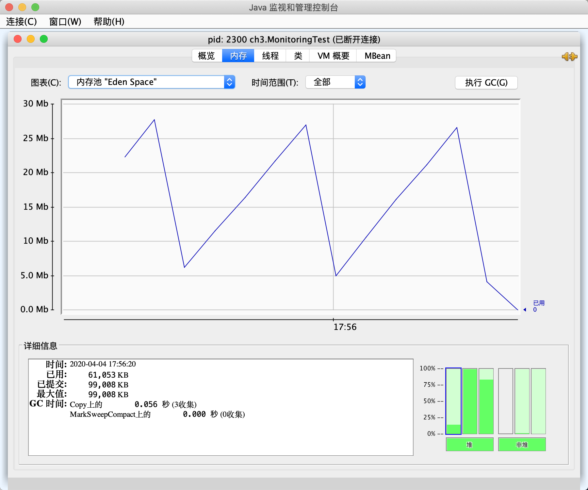
- 图4-12 Eden区内存变化状况


#### 3.线程监控
- 如果说JConsole的"内存"页签相当于可视化的jstat命令的话，那"线程"页签的功能就相当于可视化的jstack命令了，
遇到线程停顿的时候可以使用这个页签的功能进行分析。前面讲解jstack命令时提到线程长时间停顿的主要原因有等待外部资源
（数据库资源、网络资源、设备资源等）、死循环、锁等待等，代码清单4-8将分别演示这几种情况：
- 代码清单4-8 线程等待演示代码
```java
     /**
     * 线程死循环演示
     */
    public static void createBusyThread() {
        Thread thread = new Thread(new Runnable() {
            @Override
            public void run() {
                while (true) {
                    ;
                }
            }
        }, "testBusyThread");
        thread.start();
    }
    
    /**
     * 线程锁等待演示
     */
    public static void createLockThread(final Object lock) {
        Thread thread = new Thread(new Runnable() {
            @Override
            public void run() {
                synchronized (lock) {
                    try {
                        lock.wait();
                    } catch (InterruptedException e) {
                        e.printStackTrace();
                    }
                }
            }
        }, "testLockThread");
        thread.start();
    }
    
    
    public static void main(String[] args) throws IOException {
        BufferedReader br = new BufferedReader(new InputStreamReader(System.in));
        br.readLine();
        createBusyThread();
        br.readLine();
        Object obj = new Object();
        createLockThread(obj);
    }
```
- 程序运行后，首先在"线程"页签中选择main线程，如图4-13所示。堆栈追踪显示BufferedReader的readBytes()方法正在等待System.in的键盘输入，
这时候线程为Runnable状态，Runnable状态的线程仍会被分配运行时间，但readBytes()方法检查到流没有更新就会立刻归还执行令牌给操作系统，
这种等待只消耗很小的处理器资源。

- 图4-13 main线程

- 接着监控testBusyThread线程，如图4-14所示。testBusyThread线程一直在执行空循环，从堆栈追踪中看到一直在MonitoringTest.java代码的41行停留，
41行的代码为while(true)。这时候线程为Runnable状态，而且没有归还线程执行令牌的动作，所以会在空循环耗尽操作系统分配给它的执行时间，
直到线程切换为止。

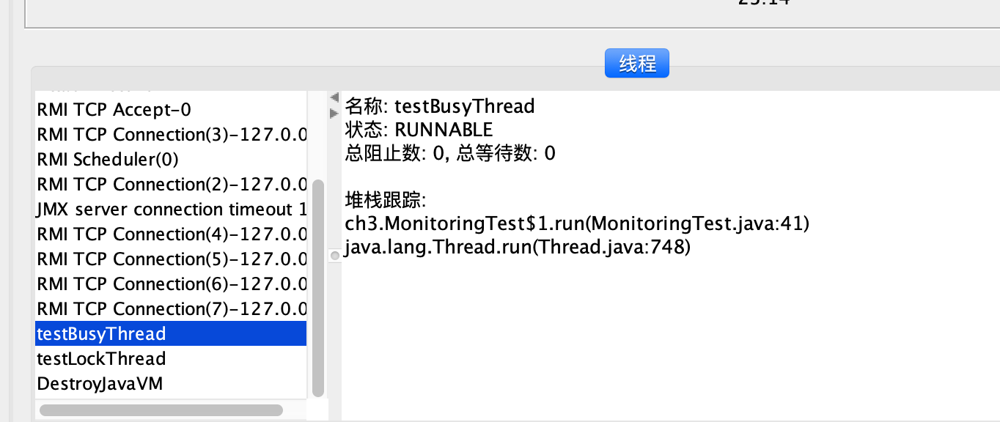
- 图4-14 testBysyThread线程

- 图4-15显示testLockThread线程在等待lock对象的notify()或notifyAll()方法的出现，线程这时候处于WAITING状态，
在重新唤醒前不会被分配执行时间。


- 图4-14 testLockThread线程

- testLockThread线程正处于正常的活锁等待中，只要lock对象的notify()或notifyAll()方法被调用，这个线程便能激活继续执行。
代码清单4-9演示了一个无法再被激活的死锁等待。
```java
    /**
     * 线程死锁等待演示
     */
    static class SynAddRunable implements Runnable {

        int a, b;
        public SynAddRunable(int a, int b) {
            this.a = a;
            this.b = b;
        }

        @Override
        public void run() {
            synchronized (Integer.valueOf(a)) {
                synchronized (Integer.valueOf(b)) {
                    System.out.println(a + b);
                }
            }
        }
    }

    public static void main(String[] args) {
        for (int i = 0; i < 100; i++) {
            new Thread(new SynAddRunable(1, 2)).start();
            new Thread(new SynAddRunable(2, 1)).start();
        }
    }
```

- 这段代码运行后会遇到线程死锁。造成死锁的根本原因是Integer.valueOf()方法出于减少对象创建次数和节省内存的考虑，
会对数值为-128 ~ 127之间的Integer对象进行缓存，如果valueOf()方法传入的参数在这个方位之内，就直接返回缓存中的对象。
也就是说代码中尽管调用了200次Integer.valueOf()方法，但一共只返回了两个不同的Integer对选哪个。
假如某个线程的两个synchronized快之间发生了一次线程切换，那就会出现线程A在等待线程B持有的Integer.valueOf()，
线程B又在等待被线程A持有的Integer.valueOf()，结果大家都跑不下去的情况。
- 出现线程死锁之后，点击JConsole线程面板的“检测死锁”按钮，将出现一个新的“死锁”页签，如图4-16所示。

- 图4-16 线程死锁


### 4.3.3 VisualVM：多合-故障处理工具
- VisualVM（All-in-One Java Troubleshooting Tool）是功能最强大的运行监视和故障处理程序之一。

#### 1.VisualVM兼容范围与插件安装
- VisualVM基于NetBeans平台开发工具，所以一开始它就具备了通过插件扩展功能的能力，有了插件扩展支持，VisualVM可以做到：
  - 显示虚拟机进程以及进程的配置、环境信息（jps、jinfo）。
  - 监视应用程序的处理器、垃圾收集、堆、方法区以及线程的信息（jstat、jstack）。
  - dump以及分析堆转储快照（jmap、jbat）。
  - 方法级的程序运行性能分析，找出被调用最多、运行时间最长的方法。
  - 离线程序快照：收集程序的运行时配置、线程dump、内存dump等信息建立一个快照，可以将快照发送开发者处进行Bug反馈。
  - 其他插件带来的无限可能性。

- VisualVM的插件可以手工进行安装，在网站上下载nbm包后，点击"工具->插件->已下载"菜单，然后再弹出对话框中指定nbm包路径便可完成安装。
VisualVM的自动安装已可找到大多数所需的插件，在有网络连接的环境下，点击“工具->插件菜单”，弹出如图4-17所示的插件页签，
在页签的“可用插件”及“已安装”中列举了当前版本VisualVM可以使用的全部插件，选中插件后在右边窗口会显示这个插件的基本信息，
如开发者、版本、功能描述等。
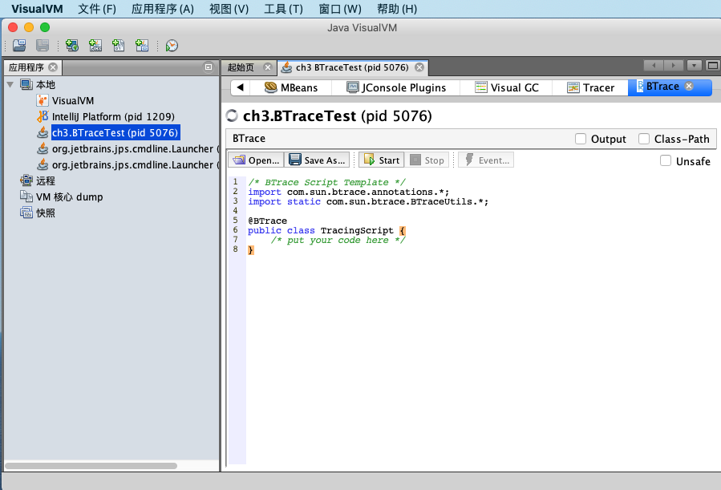
- 图4-17 线程死锁


- 读者可根据自己的工作需要和兴趣选择合适的插件，然后点击“安装”按钮，弹出如图4-18所示的下载进度窗口，
跟着提示操作即可完成安装。
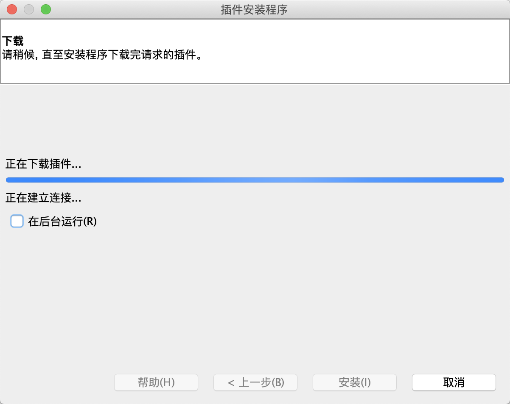
- 图4-18 VisualVM插件安装过程

- 选择一个需要监视的程序就可以进入程序的主界面了，如图4-19所示。由于VisualVM的版本以及选择安装插件数量的不同，
页签可能有所差别。

- 图4-19 VisualVM主界面


#### 2.生成、浏览堆转储快照
- 在VisualVM中生成堆转储快照文件有两种方式，可以执行下列任一操作：
  - 在“应用程序”窗口中右键单击应用程序节点，然后选择“dump”。
  - 在“应用程序”窗口中双击应用程序节点一打开应用程序标签，然后在”监视“标签中单击”堆Dump“。
- 生成堆转储快照文件之后，应用程序页签会在该堆的应用程序下增加一个以[heap-dump]开头的子节点，并且在主页签中打开该转储快照，
如图4-20所示。如果需要把堆转储快照保存或发送出去，就应在heapdump节点上右键选择”另存为“菜单，否则当VisualVM关闭时，
生成的堆转储快照文件会被当做临时文件自动清理掉。要打开一个由已经存在的堆转储快照文件，通过文件菜单的”装入“功能，选择硬盘上的文件即可。

- 图4-20 浏览dump文件


- 堆页签中的”摘要“面板可以看到应用程序dump时的运行参数、System.getProperties()的内容、线程堆栈等信息：”类“面板则是以类为统计口径统计类的实例数量、
容量信息；”实例“面板不能直接使用，因为VisualVM在此时还无法确定用户想查看哪个类的实例，所以需要通过”类“面板进入，在”类“中选择一个需要查看的类，
然后双击即可在”实例“里面看到此类的其中500个实例的具体属性信息；“OOL控制台”面板则是运行OOL查询语句的，同jhat中介绍的OOL功能一样。


#### 3.分析程序性能
- 在Profiler页签中，VisualVM提供了程序运行期间方法级的处理器执行时间分析以及内存分析。
- 要开始性能分析，先选择“CPU”和“内存”按钮中的一个，然后切换到应用程序中对程序进行操作，VisualVM会记录这段时间中应用程序执行过的所有方法。
如果是进行处理器执行时间分析，将会统计每个方法的执行次数、执行耗时；如果是内存分析，则会统计每个方法关联的对象以及这些对象所占的空间。
等要分析的操作执行结束后，点击“停止”按钮结束监控过程、如图4-21所示。
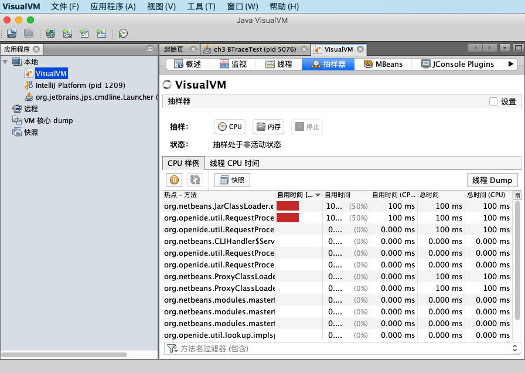
- 图4-21 对应用程序进行CPU执行时间分析

#### 4.BTrace动态日志跟踪
- BTrace是一个很神奇的VisualVM插件，它本身也是一个可运行的独立程序。BTrace的作用是在不中断目标程序运行的前提下，
通过HotSpot虚拟机的Instrument功能动态加入原本不存在的调试代码。这项功能对实际中的程序很有意义：如当程序出现问题时，
排查错误的一些必要信息时（譬如方法参数、返回值等），在开发时并没有打印日志之中以至于不得不停掉服务时，都可以通过调试增量来加入日志代码一解决问题。
- 在VisualVM中安装了BTrace插件后，在应用程序面板中右击要调试的程序，会出现“Trace Application...”菜单，点击将进入BTrace面板。
这个面板看起来就像一个简单的Java程序开发环境，里面甚至已经有了一小段Javad代码，如图4-22所示。

- 图4-22 BTrace动态追踪

- 现有一段简单的Java代码来演示BTrace的功能：产生两个1000以内的随机整数，输出这两个数字相加的结果，如代码清单4-10所示。
- 代码清单4-10 BTrace跟踪演示
```java
public class BTraceTest {

    public int add(int a, int b) {
        return a + b;
    }

    public static void main(String[] args) throws IOException {
        BTraceTest test = new BTraceTest();
        BufferedReader reader = new BufferedReader(new InputStreamReader(System.in));
        for (int i = 0; i < 10; i++) {
            reader.readLine();
            int a = (int) Math.round(Math.random() * 1000);
            int b = (int) Math.round(Math.random() * 1000);
            System.out.println(test.add(a, b));
        }
    }
}
```

- 现在想要知道程序中生成的两个随机数是什么，但程序并没有在执行过程中输出这一点。此时，在VisualVM中打开该程序的监视，
在BTrace页签填充TracingScript的内容，输入调试代码，如图清单4-11所示，即可在不中断程序运行的情况下做到这一点。
- 代码清单 4-11 BTrace调试代码
```java
/* BTrace Script Template */
import com.sun.btrace.annotations.*;
import static com.sun.btrace.BTraceUtils.*;

@BTrace
public class TracingScript {
    @OnMethod(
  clazz="ch3.BTraceTest",
  method="add",
  location=@Location(Kind.RETURN)
)

public static void func(@Self ch3.BTraceTest instance, int a, int b,
 @Return int result) {
  println("调用堆栈：");
  jstack();
  println(strcat("方法参数A：", str(a)));  
  println(strcat("方法参数B：", str(b)));
  println(strcat("方法参数结果：", str(result)));  
}
}
```

- 点击Start按钮后稍等片刻，编译完成后，Output面板中会出现“BTrace code successfully deployed”的字样。
当程序运行时将会在Output面板输出如图4-23所示的调试信息。

- 图4-23 BTrace跟踪结果

- BTrace的用途很广发，打印调用堆栈、参数、返回值只是它最基础的使用形式，在它的网站上有使用BTrace进行性能监视、
定位连接泄漏、解决多线程竞争问题等的使用案例。
- BTrace能够实现动态修改程序行为，是因为它是基于Java虚拟机的Instrument开发的。Instrument是Java虚拟机工具接口的重要组件，
提供了一套代理（Agent）机制，使得第三方工具程序可以以代理的方式访问和修改Java虚拟机的内部的数据。
阿里巴巴开源的诊断工具Arthas也通过Instrument实现了与BTrace类似的功能。


### 4.3.4 Java Mission Control：可持续在线的监控工具
- 持续收集的JFR（Java Flight Recorder）是一套内建在HotSpot虚拟机里面的监控和基于事件的信息搜集框架，与其他的监控工具（如JProfiling）相比，
Oracle特别强调它”可持续在线“的特性。JFR在JFR在生产环境中对吞吐量一般不会高于1%，而且JFR监控过程的开始、停止都是完全可动态的，
即不需要重启应用。JFR的监控对应用也是完全透明的，即不需要对应用程序的源码做任何修改，或者基于特定的代理来运行。
- JMC与虚拟机之间同样采取JMX协议进行通信，JMC一方面作为JMX控制台，显示来自虚拟机MBean提供的数据；另一方面作为JFR的分析工具，
展示来自JFR的数据。启动后JMC的主界面如图4-24所示。
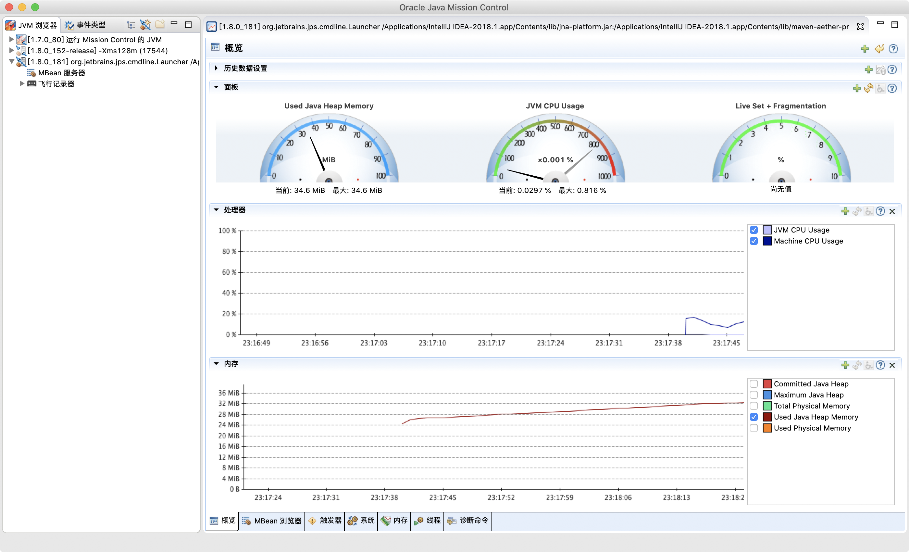
- 图4-24 JMC主界面

- 在左侧的”JVM浏览器“面板中自动显示了通过JDP协议（Java Discovery Protocol）找到的本机正在运行的HotSpot虚拟机进程，
如果需要监控其他服务器上的虚拟机，可在”文件->连接”菜单中创建远程连接，如图4-25所示。
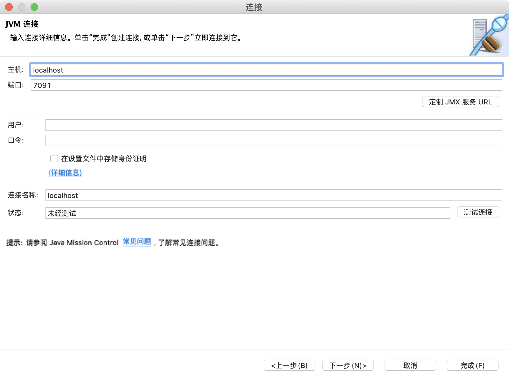
- 图4-25 JMC建立连接界面

- 这里要填写信息应该在被监控虚拟机进程启动的时候以虚拟机参数的形式指定，以下是一份被监控端的启动参数样例：
```text
-Dcom.sun.management.jmxremote.port=9999
-Dcom.sun.management.jmxremote.ssl=false
-Dcom.sun.management.jmxremote.authenticate=false
-Djava.rmi.server.hostname=192.168.31.4
-XX:+UnlockCommercialFeatures -XX:+FlightRecorder
```
- 本地虚拟机与远程虚拟机进程的差别只限于创建连接这个步骤，连接成功创建以后的操作就是完全一样的了。把”JVM浏览器”面板中的进程展开后，
可以看到每个进程的数据都有MBean和JFR两个数据源。

- 双击“飞行记录器”，将会出现“启动飞行记录”窗口，如图4-26所示。
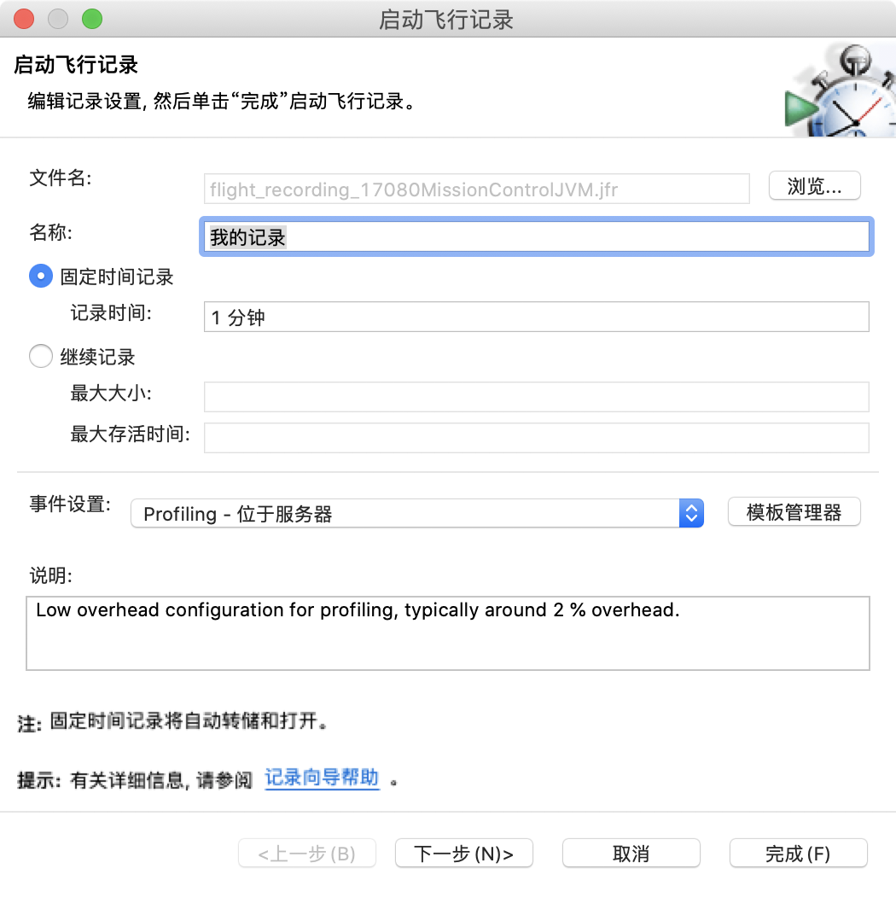
- 图4-26 启用飞行记录仪

- 点击“完成”按钮后马上就会开始记录，记录时间结束以后会生成飞行记录报告，如图4-27所示。
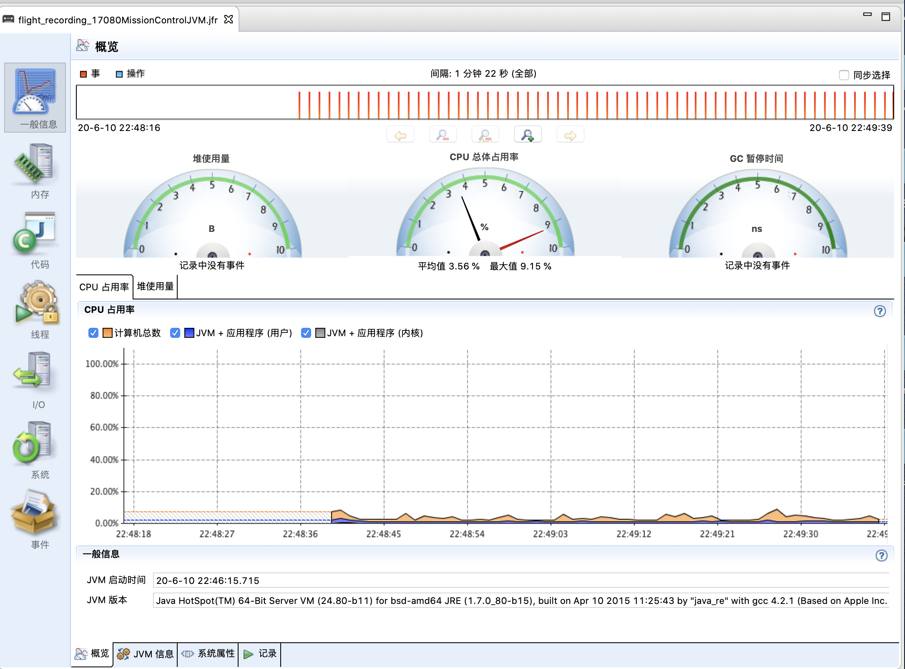
- 图4-27 飞行记录仪报告

- 飞行记录报告包含以下几类信息：
  - 一般信息：关于虚拟机、操作系统和记录的一些信息。
  - 内存：关于内存管理和垃圾收集的信息。
  - 代码：关于方法、异常错误、编译和类加载的信息。
  - 线程：关于应用程序中线程和锁的信息。
  - I/O：关于文件和套接字输入、输出的信息。
  - 系统：关于正在运行Java虚拟机的系统、进程和环境变量的信息。
  - 事件：关于记录中的事件类型的信息，可以根据线程或堆栈跟踪，按照日志或图形的格式查看。

- JFR的基本工作逻辑是开启一系列的录制动作，当某个事件发生时，这个事件的所有上下文数据将会以循环日志的形式被保存至内存或者指定的某个文件当中，
循环日志相当于数据流被保留在一个环形缓存中，所以只有最近发生的事件的数据才是可用的。JMC从虚拟机内存或者文件中读取并展示这些事件数据，
并通过这些数据进行性能分析。


## 4.4 HotSpot虚拟机插件及工具
- 在HotSpot虚拟机的研发过程中，开发团队曾经编写过不少虚拟机的插件和辅助工具。它们存放在HotSpot源码hotspot/src/share/tools目录下，包括：
  - Ideal Graph Visualizer：用于可视化展示C2即时编译器是如何将字节码转化为理想图，然后转化为机器码的。
  - Client Compiler Visualizer：用户查看C1即时编译器生成高级中间表示（HIR），转换成低级中间表示（LIR）和物理寄存器分配的过程。
  - MakeDeps：帮助处理HotSpot的编译依赖的工具。
  - Project Creator：帮忙生成Visual Studio的project文件的工具。
  - LogCompilation：将-XX:+LogCompilation输出的日志整理成更容易阅读的格式的工具。
  - HSDIS：即时编译器的反汇编组件。

### HSDIS：JIT生成代码反汇编
- HSDIS是一个被官方推荐的HotSpot虚拟机即时编译代码的反汇编插件，它包含在一个HotSpot虚拟机的源码当中。
- HSDIS插件的作用是让HotSpot的-XX:+PrintAssembly指令调用它来把即时编译器动态生成的本地代码还原为汇编代码输出，
同事还会自动产生大量非常有价值的注释，这样我们就可以通过输出的汇编代码来从最本质的角度分析问题。笔者以代码清单4-12中的测试代码为例简单演示一下如何使用这个插件。
- 代码清单4-12 测试代码

```java
public class Bar {
    int a = 1;
    static int b = 2;

    public int sum(int c) {
        return a + b + c;
    }

    public static void main(String[] args) {
        new Bar().sum(3);
    }
}
```
- 编译这段代码，并使用以下命令执行。如果使用的是Product版的HotSpot，则还需要加入一个-XX:+UnlockDiagnosticVMOptions参数才可以工作。

```text
 java -XX:+PrintAssembly -Xcomp -XX:CompileCommand=dontinline, *Bar.sum -XX:CompileCommand=compileonly,*Bar.sum test.Bar
```
- 其中，参数-Xcomp是让虚拟机以编译模式执行代码，这样不需要执行足够次数来预热就能触发即使编译。
两个-XX:CompileCommand的意思是让编译器不要内联sum()并且只编译sum(),-XX:+PrintAssembly就是输出反汇编内容。


- JITWatch是HSIDS经常搭配使用的可视化的编译日志分析工具，为便于在JITWatch中读取，
读者可使用以下参数把日志输出到logfile文件：
```text
 -XX:+UnlockDiagnosticVMOptions 
 -XX:+TraceClassLoading 
 -XX:+LogCompilation 
 -XX:LogFile=/tmp/logfile.log 
 -XX:+PrintAssembly 
 -XX:+TraceClassLoading  
```

- 在JITWatch中加载日志后，就可以看到执行期间使用过的各种类型和对应调用过的方法了，界面如图4-28所示。

- 图4-28 JITWatch主界面


- 选择想要查看的类和方法，即可查看对应的Java源代码、字节码和即时编译器生成的汇编代码，如图4-29所示。

- 图4-29 查看方法代码


