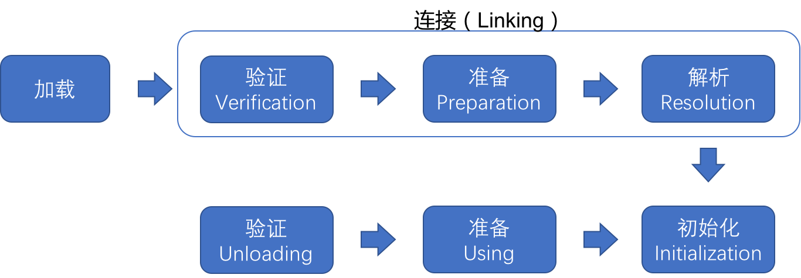

# 第7章 虚拟机类加载机制

## 7.1 概述
- Java虚拟机把描述类的数据从Class文件加载到内存，并对数据进行校验，转换解析和初始化，最终形成可以被虚拟机直接使用的Java类型，这个过程被称作虚拟机的类加载机制。
 
## 7.2 类加载的时机
- 一个类型从被加载到虚拟机内存中开始，到卸载初内存为止，它的整个生命周期将会经历加载、验证、准备、解析、初始化、使用和卸载七个阶段，
其中验证、准备、解析三个部分统称为连接。这七个阶段的发生顺序如图7-1所示。
  
- <div style="text-align: center;">图7-1 类的生命周期 </div>
- 对于初始化阶段，《Java虚拟机规范》严格规定了有且只有六种情况必须对类进行“初始化”：
  - 1）遇到new、getstatic、putstatic或invokestatic这四条字节码指令时，如果类型没有进行过初始化，则需要先触发其初始化阶段。能够生成这四条指令的典型Java代码场景有：
    - 使用new关键字进行实例化对象的时候。
    - 读取或设置一个类型的静态字段（被final修饰、已在编译期把结果放入常量池的静态字段除外）的时候。
    - 调用一个类型的静态方法的时候。
  - 2）使用java.lang.reflect包的方法对类型进行反射调用的时候，如果类型没有进行过初始化，则需要先触发其初始化。
  - 3）当初始化类的时候，如果发现其父类还没有进行过初始化，则需要先触发其父类的初始化。
  - 4）当虚拟机启动时，用户需要指定一个要执行的主类（包含main()方法的那个类），虚拟机会先初始化这个类。
  - 5）当使用JDK7新加入的动态语言支持时，如果一个java.lang.invoke.MethodHandle实例最后的解析结果为REF_getStatic、REF_putStatic、REF_invokeStatic、REF_newInvokeSpecial四种类型的方法句柄，并且这个方法句柄对应的类没有进行过初始化，则需要先触发其初始化。
  - 6）当一个接口中定义了JDK8新加入的默认方法（被default关键字修饰的接口方法）时，如果有这个接口的实现类发生了初始化，那该接口要在其之前被初始化。
- 以上六种场景中的行为称为对一个类型进行主动引用。除此之外，所有引用类型的方式都不会出发初始化，称为被动引用。以下三点说明何为被动引用。
  - 1）通过子类引用父类的静态字段，不会导致子类初始化。
  - 2）通过数组定义来引用类，不会触发类的初始化。
  - 3）常量在编译阶段会存入调用类的常量池中，本质上没有直接引用到定义常量的类，因此不会触发定义常量类的初始化。  
  
## 7.3 类的加载过程
### 7.3.1 加载
- 在加载阶段，Java虚拟机需要完成以下三件事情：
  - 1）通过一个类的全限定名来获取定义此类的二进制字节流。
  - 2）讲这个字节流所代表的静态存储结构转化为方法区的运行时数据结构。
  - 3）在内存中生成一个代表这个类的java.lang.Class对象，作为方法区这个类的各种数据的访问入口。
- 对于数组类而言，情况就有所不同，数组类本身不通过类的加载器创建，它是由Java虚拟机直接在内存中动态构造出来的。但数组类与类加载仍然有很密切的关系，
因为数组类的元素类型最终还是要靠类加载来完成加载，一个数组类（下面简称为C）创建的过程遵循以下规则：
  - 如果数组的组件类型是引用类型，那就递归采用本节中定义的加载过程去加载这个组件类型，数组C将被标识在加载该组件类型的类加载器的类名称空间上。
  - 如果数组的组件类型不是引用类型（例如int[]数组的组件类型为int），Java虚拟机将会把数组C标记为与引导类加载器关联。
  - 数组类的可访问性与它的组件类型的可访问性一致，如果组件类型不是引用类型，它的数组类的可访问性将默认为public，可被所有的类的接口访问到。
- 加载阶段结束后，Java虚拟机外部的二进制字节流就按照虚拟机所设定的格式存储在方法区之中了，方法区中的数据存储格式完全由虚拟机实行自定义。
类型数据妥善安置在方法区之后，会在Java堆内存中实例化一个java.lang.Class类的对象，这个对象将作为程序访问方法区中的类型数据的外部接口。
  
### 7.3.2 验证
- 验证是连接阶段的第一步，这一阶段的目的是确保Class文件的字节流中包含的信息符合《Java虚拟机规范》的全部约束要求，
保证这些信息被当作代码运行不会危害虚拟机自身的安全。
- 验证阶段大致上会完成下面四个阶段的检验动作：文件格式验证、元数据验证、字节码验证和符号引用验证。

#### 1.文件格式验证  
- 第一阶段要验证字节流是否符合Class文件格式的规范，并且能被当前版本的虚拟机处理。这一阶段可能包括下面这些验证点：
  - 是否以魔数0xCAFEBABE开头。
  - 主、次版号是否在当前Java虚拟机接受范围之内。
  - 常量池的常量中是否有指向不存在的常量或不符合类型的常量。
  - CONSTANT_Utf8_info型常量中是否不符合UTF-8编码的数据。
  - Class文件中各个部分及文件本身是否有被删除的或附加的其他信息。
  - ......
- 该验证阶段的主要目的是保证输入的字节流能正确地解析并存储于方法区之内，格式上符合描述一个Java类型信息的要求。
这阶段的验证是基于二进制字节流进行的，只有通过了这个阶段的验证之后，这段字节流才被允许进入Java虚拟机内存的方法区中进行存储，
所以后面的三个验证阶段全部都是基于方法区的存储结构上进行的，不会再直接读取、操作字节流了。

#### 2.元数据验证
- 第二阶段是对字节码描述的信息进行语义分析，以保证其描述的信息符合《Java语言规范》的要求，这个阶段可能包括的验证点如下：
  - 这个类是否有父类（除了java.lang.Object之外，所有的类都应当有父类）。
  - 这个类的父类是否继承了不允许被继承的类（被final修饰的类）。
  - 如果这个类不是抽象类，是否实现了其父类或接口之中要求实现的所有方法。
  - 类中的字段、方法是否与父类产生矛盾（例如覆盖了父类的final字段，或者出现不符合规则的方法重载，例如方法参数都一致，但返回值类型却不同等）。
  - ......
- 第二阶段的主要目的是对类的元数据信息进行语义校验，保证不存在与《Java语言规范》定义相悖的元数据信息。

#### 3.字节码验证
- 第三阶段主要目的是通过数据流分析和控制流分析，确定程序语义是合法的、符合逻辑的。该阶段对类的方法体（Class文件中的Code属性）进行分析，
保证被校验类的方法在运行时不会做出危害虚拟机安全的行为，例如：
  - 保证任意时刻操作数栈的数据类型与指令代码序列都能配合工作，例如不会出现类似于"在操作栈放置了一个int类型的数据，
  使用时却按long类型来加载入本地变量表中"这样的情况。
  - 保证任何跳转指令都不会跳转到方法体以外的字节码指令上。
  - 保证方法体中的类型转换总是有效的，例如可以把一个子类对象赋值给父类数据类型，这是安全的，但是把父类对象赋值给子类数据类型，
  甚至把对象赋值给与它毫无继承关系、完全不相干的一个数据类型，则是危险和不合法的。
  - ......
  
#### 4.符号引用验证
- 最后一个阶段的校验行为发生在虚拟机将符号引用转化为直接引用的时候，这个转化动作将在连接的第三阶段————解析阶段中发生。
符号引用验证可以看做是对类自身以外（常量池中的各种符号引用）的各类信息进行匹配性校验，通俗来说就是，
该类是否缺少或者被禁止访问它依赖的某些外部类、方法、字段等资源。本阶段通常需要校验下列内容：  
  - 符号引用中通过字符串描述的全限定名是否能找到对应的类。
  - 在指定类中是否存在符合方法的字段描述符及简单名称所描述的方法和字段。
  - 符号引用中的类、字段、方法的可访问性（private、protected、public、<package>)是否可被当前类访问。
  - ...
  

### 7.3.3 准备
- 准备阶段是正式为类中的变量（即静态变量，被static修饰的变量）分配内存并设置类变量初始值的阶段。
- 关于准备阶段，有两个概念需要着重强调，首先是这时候进行内存分配的仅包括类变量，而不包括实例变量，
实例变量将会在对象实例化的时候随着对象一起分配在Java堆中。其次是这里所说的初始值"通常情况"下是数据类型的零值，假设一个类变量定义为：
```java
  public static int value = 123;
```
- 那变量value在准备阶段过后的初始值为0而不是123，因为这时尚未开始执行任何Java方法，而把value赋值为123的putstatic指令是程序编译后，
存放于类构造器<clinit>()方法之中，所以把value赋值为123的动作要到类的初始化阶段才会被执行。
- 某些"特殊情况"下初始值不是零值：如果类字段的字段属性表中存在ConstantValue属性，那在准备阶段变量值就会被初始化为ConstantValue属性所指定的初始值，
假设上面类变量value的定义修改为：
```java
  public static final int value = 123;
```
- 编译时Javac将会为value生成ConstatntValue属性，在准备阶段虚拟机就会根据ConstantValue的设置将value赋值为123。


### 7.3.4 解析
- 解析阶段是Java虚拟机讲常量池内的符号引用替换为直接引用的过程。直接引用与符号引用有什么关联关系？
- 符号引用：符号引用以一组符号来描述所引用的目标，符号可以是任何形式的字面量，只要使用时能无歧义地定位到目标即可。
符号引用与虚拟机实现的内存布局无关，引用的目标并不一定是已经加载到内存及内存当中的内容。各种虚拟机实现的内存布局可以各不相同，
但是它们能接受的符号引用必须都是一致的，因为符号引用的字面量形式明确定义在《Java虚拟机规范》的Class文件格式中。
- 直接引用：直接引用是可以直接指向目标的指针、针对偏移量或者是一个能间接定位到目标的句柄。直接引用是和虚拟机实现的内存布局直接相关的，
同一个符号引用在不同虚拟机实例上翻译出来的直接引用一般不会相同。如果有了直接引用，那引用的目标必定已经在虚拟机的内存中存在。
- 对同一个符号引用进行多次解析请求是很常见的事情，除invokedynamic指令以外，虚拟机实现可以对第一次解析的结果进行缓存，
譬如在运行时直接引用常量池中的记录，并把常量标识为已解析状态，从而避免解析动作重复进行。无论是否真正执行了多次解析动作，
Java虚拟机都需要保证的是在同一个实体中，如果一个符号引用之前已经被成功解析过，那么后续的引用解析请求就应当一直能够成功；
同样地，如果第一次解析失败了，其他指令对这个符号的解析也应该收到同样地异常，哪怕这个请求的符号在后来已成功加载进Java虚拟机内存之中。
- 解析动作主要针对类或接口、字段、类方法、接口方法、方法类型、方法句柄和调用点限定符这7类符号引用进行。


### 7.3.5 初始化
- 直到初始化阶段，Java虚拟机才真正开始执行类中编写的Java程序代码，将主导权移交给应用程序。
- 初始化阶段就是执行类构造器<clinit>()方法的过程。<clinit>()并不是程序员在Java代码中直接编写的方法，它是Javac编译器的自动生成物，
但我们非常有必要了解这个方法具体是如何产生的，以及其可能影响程序运行行为的细节。
  - <clinit>()方法是由编译器自动收集类中的所有变量的赋值动作和静态语句块（static{}块）中的语句合并产生的，
  编译器收集的顺序是由语句在源文件中出现的顺序决定的，静态语句块中只能访问到定义在静态语句块之前的变量，定义在它之后的变量，
  在前面的静态语句块可以赋值，但是不能访问，如代码清单7-5所示。
- 代码清单7-5 非法前向引用变量
```java
public class Test {
    static {
        i = 0; // 给变量复制可以正常编译通过
        System.out.println(i); // 这句编译会提示"非法向前引用"
    }
    static int i = 1;
}
```
  - <clinit>()方法与类的构造函数（即在虚拟机视角中的实例构造器<init>()方法）不同，它不需要显式地调用父类构造器，
  Java虚拟机会保证在子类的<clinit>()方法执行前，父类的<clinit>()方法已经执行完毕。
  因此在Java虚拟机中第一个被执行的<clinit>()方法的类型肯定是java.lang.Object。
  - 由于父类的<clinit>()方法先执行，也就意味着父类中定义的静态语句块要优先于类的变量赋值操作，如代码清单7-6中，
  字段B的值将会是2而不是1。
- 代码清单7-6 <clinit>()方法执行顺序
```java
 static class Parent {
    public static int A = 1;

    static {
        A = 2;
    }
}

static class Sub extends Parent {
    public static int B = A;
}

public static void main(String[] args) {
    System.out.println(Sub.B);
}
```
  - <clinit>()方法对于类或接口来说并不是必需的，如果一个类中没有静态语句块，也没有对变量的赋值操作，那么编译器可以不为这个类生成<clinit>()方法。
  - 接口中不能使用静态语句块，但仍然有变量初始化的赋值操作，因此接口与类一样都会生成<clinit>()方法。但接口与类不同的是，
  执行接口的<clinit>()方法不需要先执行父接口的<clinit>()方法，因为只有当父接口中定义的变量被使用时，父接口才会被初始化。
  此外，接口的实现类在初始化时也一样不会执行接口的<clinit>()方法。
  - Java虚拟机必需保证一个类的<clinit>()方法在多线程环境中被正确地加锁同步，如果多个线程同时去初始化一个类，
  那么只会有其中一个线程去执行这个类的<clinit>()方法，其他线程都需要阻塞等待，直到活动线程执行完毕<clinit>()方法。
  如果在一个类中的<clinit>()方法中有耗时较长的操作，那就可能造成多个进程阻塞，在实际应用中这种阻塞往往是很隐蔽的。
  代码清单7-7演示了这种场景。
- 代码清单7-7 字段解析
```java
public class DeadLoopClass {
    static {
        // 如果不加上这个 if 语句，编译器提示"Initializer must be able to complete normally"并拒绝编译
        if (true) {
            System.out.println(Thread.currentThread() + "init DeadLoopClass");
            while (true) {

            }
        }
    }
}

class DeadLoopClassTest {
    public static void main(String[] args) {
        Runnable script = new Runnable() {
            @Override
            public void run() {
                System.out.println(Thread.currentThread() + "start");
                DeadLoopClass dlc = new DeadLoopClass();
                System.out.println(Thread.currentThread() + "run over");
            }
        };

        Thread thread1 = new Thread(script);
        Thread thread2 = new Thread(script);
        thread1.start();
        thread2.start();
    }
}
```
- 运行结果如下，一条线程在死循环以模拟长时间操作，另外一条线程在阻塞等待：
```text
Thread[Thread-1,5,main]start
Thread[Thread-0,5,main]start
Thread[Thread-1,5,main]init DeadLoopClass
```


## 7.4 类加载器
- Java虚拟机设计团队有意把类加载阶段中的"通过一个类的全限定名类获取描述该类的二进制字节流"这个动作放到Java虚拟机外部去实现，
以便让应用程序自己决定如何去获取所需的类。实现这个动作的代码被称作为"类加载器"（Class Loader）。

### 7.4.1 类与类加载器
- 对于任意一个类，都必须由加载它的类加载器和这个类本身一起共同确立其在Java虚拟机中的唯一性，每一个类加载器，都拥有一个独立的类名称空间。
这句话可以表达得更通俗一些：比较两个类是否"相等"，只有在这两个类是由同一个类加载器加载的前提下才有意义，否则，即使这两个类来源于同一个Class文件，
被同一个Java虚拟机加载，只要加载它们的类加载器不同，那这两个类就必定不相等。
- 这里所指的"相等"，包括代表类的Class对象的equals()方法、isAssignableFrom()方法、isInstance()方法的返回结果，
也包括了使用instanceof关键字做对象所属关系判定等各种情况。代码清单7-8中演示了不同的类加载器对instanceof关键字运算的结果的影响。
- 代码清单7-8 不同的类加载器对instanceof关键字运算的结果的影响
```java

/**
 * 类加载器与 instanceof 关键字演示
 */
public class ClassLoaderTest {
    public static void main(String[] args) throws Exception {
        ClassLoader myLoader = new ClassLoader() {
            @Override
            public Class<?> loadClass(String name) throws ClassNotFoundException {
                try {
                    String fileName = name.substring(name.lastIndexOf(".") + 1) + ".class";
                    InputStream is = getClass().getResourceAsStream(fileName);
                    if (is == null) {
                        return super.loadClass(name);
                    }
                    byte[] b = new byte[is.available()];
                    is.read(b);
                    return defineClass(name, b, 0, b.length);
                } catch (IOException e) {
                    throw new ClassNotFoundException(name);
                }
            }
        };

        Object obj = myLoader.loadClass("org.fenixsoft.classloading.ClassLoaderTest").newInstance();

        System.out.println(obj.getClass());
        System.out.println(obj instanceof org.fenixsoft.classloading.ClassLoaderTest);
    }
}
```
- 运行结果：
```text
class org.fenixsoft.classloading.ClassLoaderTest
false
```
- 两行结果输出中，从第一行可以看到这个对象确实是类org.fenixsoft.classloading.ClassLoaderTest实例化出来的，
但在第二行的输出中却发现这个对象与类org.fenixsoft.classloading.ClassLoaderTest所属类型检查的时候返回了false。
这是因为Java虚拟机中同时存在了两个ClassLoaderTest类，一个是由虚拟机的应用程序类加载器所加载的，另外一个是由我们自定义的类加载器加载的，
虽然它们都来自同一个Class文件，但在Java虚拟机中仍然是两个相互独立的类，做对象所属类型检查时的结果自然为false。


### 7.4.2 双亲委派模型
- 本节内容将针对JDK8及之前版本的Java来介绍什么事三层类加载器，以及什么是双亲委派模型。对于这个时期的Java应用，
绝大多数Java程序都会使用到以下3个系统提供的类加载器进行加载。
  - 启动类加载器：这个类加载器负责加载存放在<JAVA_HOME>\lib目录，或者被-Xbootclasspath参数所指定的路径中存放的，
  而且是Java虚拟机能够识别的类库加载到虚拟机的内存中。启动类加载器无法被Java程序直接引用，用户在编写自定义类加载器时，
  如果需要把加载请求委派给引导类加载器去处理，那直接使用null代替即可。
  - 扩展类加载器：这个类加载器是在类sun.misc.Launcher$ExtClassLoader中以Java代码的形式实现的。它负责加载<JAVA_HOME>\lib\ext目录中，
  或者被java.ext.dirs系统变量所指定的路径中所有的类库。根据"扩展类加载器"这个名称，就可以推断这是一种Java系统类库的扩展机制。
  由于扩展类加载器是由Java代码实现的，开发者可以直接在程序中使用扩展类加载器来加载Class文件。
  - 应用程序类加载器：这个类加载器由sun.misc.Launcher$AppClassLoader来实现。由于应用程序类加载器是ClassLoader类中的getSystemClassLoader()方法的返回值，
  所以有些场合中也称它为"系统类加载器"。它负责加载用户路径（ClassPath）上所有的类库，开发者同样可以直接在代码中使用这个类加载器。
  如果应用程序中没有自定义过自己的类加载器，一般情况下这个就是程序中默认的类加载器。

- 图7-2 类加载器双亲委派模型
- 图7-2中展示的各种类加载器之间的层次关系被称为类加载器的"双亲委派模型"。双亲委派模型要求除了顶层的启动类加载器外，
其余的类加载器都应该有自己的父类加载器。不过这里类加载器之间的父子关系一般不是以继承的关系来实现的，而是通常使用组合关系来复用父加载器的代码。
- 双亲委派模型的工作过程：如果一个类加载器收到了类加载的请求，它首先不会自己去尝试加载这个类，而是把这个请求委派给父类加载器去完成，
每一个层次的类加载器都是如此，因此所有的加载请求最终都应该传送到最顶层的启动类加载器中，只有当父加载器反馈自己无法完成这个加载请求（它的搜索范围中没有找到所需的类）时，
子加载器才会尝试自己去完成加载。
- 使用双亲委派模型来组织类加载器之间的关系，一个显而易见的好处就是Java中的类随着它的类加载器一起具备了一种带有优先级的层次关系。
例如类java.lang.Object，它存放在rt.jar之中，无论哪一个类加载器要加载这个类，最终都是委派给处于模型最顶端的启动类加载进行加载，
因此Object类在程序的各种类加载器环境中都能够保证是同一个类。反之，如果没有使用双亲委派模型，都由各个类加载器自行去加载的话，
如果用户自己也编写了一个名为java.lang.Object的类，并且放在程序中的ClassPath中，那系统中就会出现多个不同的Object类，
Java类型体系中最基础的行为也就无从保证，应用程序将会变得一片混乱。
- 双亲委派模型对于保证Java程序中的稳定运作极为重要，但它的实现却异常简单，用以实现双亲委派的代码只有短短十余行，
全部集中在java.lang.ClassLoader的loadClass()方法之中，如代码清单7-10所示。
```java
 protected synchronized Class<?> loadClass(String name, boolean resolve)
            throws ClassNotFoundException
    {
        // 首先，检查请求的类是否已经被加载过了
        Class<?> c = findLoadedClass(name);
        if (c == null) {
            long t0 = System.nanoTime();
            try {
                if (parent != null) {
                    c = parent.loadClass(name, false);
                } else {
                    c = findBootstrapClassOrNull(name);
                }
            } catch (ClassNotFoundException e) {
                // 如果父类加载器抛出 ClassNotFoundException
                // 说明父类加载器无法完成加载请求
            }

            if (c == null) {
                // 在父类加载器无法加载时
                // 再调用本身的 findClass 方法来进行类加载
                long t1 = System.nanoTime();
                c = findClass(name);

            }
        }
        if (resolve) {
            resolveClass(c);
        }
        return c;
    }
```
- 这段代码逻辑：先检查请求加载的类型是否已经被加载过，若没有则调用父加载器的loadClass()方法，若父加载器为空则默认使用启动类加载器作为父加载器。
加入父类加载器加载失败，抛出 ClassNotFoundException 异常的话，才调用自己的findClass()方法尝试进行加载。