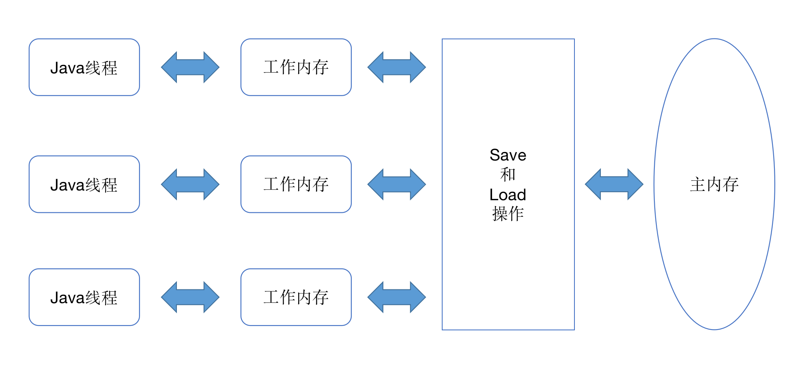
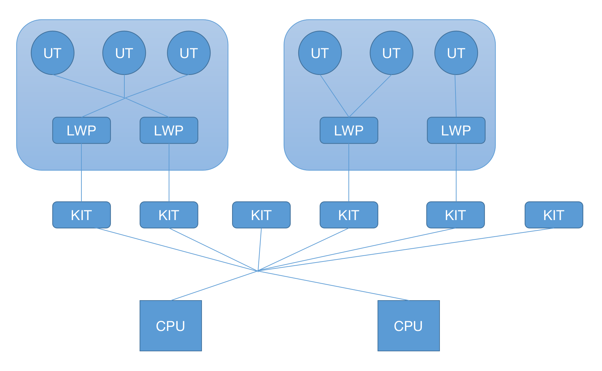
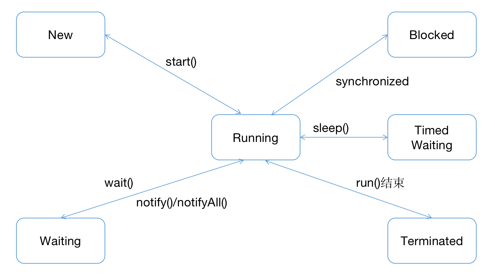

# 第12章 Java内存模型与线程

## 12.2 硬件的效率与一致性
- 基于高速缓存的存储交互很好地解决了处理器与内存速度之间的矛盾，但是也为计算机系统带来更高的复杂度，它引入一个新的问题：
缓存一致性（Cache Coherence）。在多路处理系统中，每个处理器都有自己的高速缓存，而它们又共享同一主内存（Main Memory），
这种系统称为共享内存多核系统（Shared Memory Multiprocessors System），如图12-1所示。当多个处理器的运算任务都涉及同一块主内存区域时，
将可能导致各自的缓存数据不一致。如果真的发生这种情况，那同步回到主内存该以谁的缓存数据为准呢？为了解决一致性的问题，
需要各个处理器访问缓存时都遵循一些协议，在读写时要根据协议来进行操作，这类协议有MSI，MESI（Illinois Protocol）、MOSI、
Synapse、Firefly及Dragon Protocol等。从本章开始，我们将会频繁见到"内存模型"一词，它可以理解为在特定的操作协议下，
对特定的内存或高速缓存进行读写访问的过程抽象。不同架构的物理机器可以拥有不一样的内存模型，而Java虚拟机也有自己的内存模型，
并且与这里介绍的内存访问操作及硬件的缓存访问操作具有高度的可类比性。

&nbsp;&nbsp;&nbsp;&nbsp;&nbsp;&nbsp;&nbsp;&nbsp;&nbsp;&nbsp;&nbsp;&nbsp;&nbsp;&nbsp;
图12-1 处理器、高速缓存、主内存间的交互关系 

- 处理增加高速缓存之外，为了使处理器内部的运算单元尽量被充分利用，处理器可能会输入代码进行乱序执行（Out-Of-Order Execution）优化，
处理器会在计算之后将乱序执行的结果重组，保证该结果与顺序执行的结果是一致的，但并不保证程序中各个语句计算的先后顺序与输入代码中的顺序一致，
因此如果存在一个计算任务依赖另一个计算任务的中间结果，那么其顺序性并不能靠代码的先后顺序来保证。与处理器的乱序执行优化类似，
Java虚拟机的即时编译器中也有指令重排序（Instruction Reorder）优化。

## 12.3 Java内存模型

### 12.3.1 主内存与工作内存
- Java内存模型的主要目的是定义程序中各种变量的访问规则，即关注在虚拟机中把变量值存储到内存和从内存中去除变量值这样的底层细节。
为了获取更好的执行效能，Java内存模型并没有限制执行引擎使用处理器的特定寄存器或缓存来和主内存进行交互，也没有限制即时编译器是否要进行调整代码执行这类优化措施。
- Java内存模型规定了所有的变量都存储在主内存（Main Memory）中。每条线程还有自己的工作内存（Working Memory，可与前面讲的高速缓存类比），
线程的工作内存中保存了被该线程使用的变量的主内存副本，线程对变量的所有操作（读取、赋值等）都必须在工作内存中进行，
而不能直接读写内存中的数据。不同的线程之间也无法直接访问对方工作内存中的变量，线程间变量值的传递均需要通过主内存来完成，
线程、主内存、工作内存三者的交互关系如图12-2所示，注意与图12-1进行对比。

&nbsp;&nbsp;&nbsp;&nbsp;&nbsp;&nbsp;&nbsp;&nbsp;&nbsp;&nbsp;&nbsp;&nbsp;&nbsp;&nbsp;
图12-2 线程、主内存、工作内存三者的交互关系

### 12.3.2 内存间交互操作线程状态转换关系
- 关于主内存与工作内存之间具体的交互协议，即一个变量如何从主内存拷贝到工作内存、如何从工作内存同步回主内存这一类的实现细节，
Java内存模型中定义了以外8种操作来完成。Java虚拟机实现时必须保证下面提及的每一种操作都是原子的、不可再分的（对于double和long类型的变量来说，
load、store、read和write操作在某些平台上允许有例外，这个问题在12.3.4节会专门讨论）。
  - load（锁定）：作用于主内存的变量，它把一个变量标识为一条线程独占的状态。
  - unlock（解锁）：作用于主内存的变量，它把一个处于锁定状态的变量释放出来，释放后的变量才可以被其他线程锁定。
  - read（读取）：作用于主内存的变量，它把一个变量的值从主内存传输到线程的工作内存中，一遍随后的load动作使用。
  - load（载入）：作用于工作内存的变量，它把read操作从主内存中得到的变量值放入工作内存的变量副本中。
  - use（使用）：作用于工作内存的变量，它把工作内存中一个变量的值传递给执行引擎，每当虚拟机遇到一个需要使用变量的值的字节码指令时将会执行这个操作。
  - assign（赋值）：作用于工作内存的变量，它把一个从执行引擎接受的值赋给工作内存的变量，每当虚拟机遇到一个变量赋值的字节码指令时执行这个操作。
  - store（存储）：作用于工作内存中的变量，它把工作内存中一个变量的值传送到主内存中，以便随后的write操作使用。
  - write（写入）：作用于主内存中，它把store操作从工作内存中得到的变量的值放入主内存的变量中。
- 如果要把一个变量从主内存拷贝到工作内存，那就要按顺序执行read和load操作，如果要把变量从工作内存同步回主内存，
就要按顺序执行store和write操作。注意，Java内存模型只要求上述两个操作必须按顺序执行，但不要求是连续执行。也就是说read和load之间、
store与write之间是可插入其他指令的，如对主内存中的变量a、b进行访问时、一种可能出现的顺序是read a、read b、load b、 load a。
除此之外，Java内存模型还规定了再执行上述8中基本操作时必须满足如下规则：
  - 不允许read和load、store和write操作之一单独出现，即不允许一个变量从主内存读取了但工作内存不接受，或者工作内存发起回写了但主内存不接受的情况出现。
  - 不允许一个线程丢弃它最近的assign操作，即变量在工作内存中改变了之后必须把该变化同步回主内存。
  - 一个新的变量只能在主内存中“诞生”，不允许在工作内存中直接使用一个未被初始化（load或assign）的变量，换句话说就是对一个变量实施use、store操作之前，必须先执行assign和load操作。
  - 一个变量在同一个时刻只允许一条线程对其进行lock操作，但lock操作可以被同一条线程重复执行多次，多次执行lock后，
  只有执行相同次数的unlock操作，变量才会被解锁。
  - 如果对一个变量执行lock操作，那将会清空工作内存中此变量的值，在执行引擎使用这个变量前，需要重新执行load或assign操作以初始化变量的值。
  - 如果一个变量事先没有被lock操作锁定，那就不允许对它执行unlock操作，也不允许去unlock一个被其他线程锁定的变量。
  - 对一个变量执行unlock操作之前，必须先把此变量同步回主内存中（执行share、write操作）。
 - 以上8种内存访问操作较为繁琐，后来将Java内存模型的操作简化为read、write、lock和unlock四种，但这只是语言上的等价化简，Java内存模型的基础设计并未改变。

### 12.3.3 对于volatile型变量的特殊规则
- 当一个变量被定义成volatile之后，它将具备两项特性：第一项是保证此变量对所有线程的可见性，这里的“可见性”是指当一条线程修改了这个变量的值，新值对于其他线程来说是可以立即得知的。
而普通变量并不能做到这一点，普通变量的值在线程间传递时均需要通过主内存来完成。比如，线程A修改了一个普通变量的值，然后向主内存进行回写，另外一条线程B在线程A回写完成了之后再对主内存进行读取操作，新变量值才会对线程B可见。
- volatile变量对所有线程是立即可见的，对volatile变量所有的写操作都能立即反映到其他线程之中。换句话说，volatile变量在各个线程中是一致的，
但不能说基于volatile变量的运算在并发下是线性安全的。
- 由于volatile变量只能保证可见性，在不符合以下两条规则的运算场景中，我们仍然要通过加锁（synchronized、java.util.concurrent中的锁或原子类）来保证原子性：
  - 运算结果并不依赖变量的当前值，或者能够确保只有单一的线程修改变量的值。
  - 变量不需要与其他的状态变量共同参与不变约束。
- 使用volatile变量的第二个语义是禁止指令重排序优化，普通的变量仅会保证在该方法的执行过程中所有依赖赋值结果的地方都能够获取到正确的结果，
而不能保证变量赋值操作的顺序与程序代码中的执行顺序一致。

### 12.3.4 针对long和double型变量的特殊规则
Java内存模型对于64位的数据类型（long和double）定义了一条宽松的规定：允许虚拟机将没有被volatile修饰的64位数据的读写操作划分为两次32位的操作来进行，
即允许虚拟机实现自行选择是否要保证64位数据类型的load、store、read和write这四个操作的原子性，这就是所谓的“long和double的非原子性协定“（Non-Atomic Treatment of double and long Variables）。

### 12.3.5 原子性、可见性与有序性
- 1. 原子性（Atomicity）
  - 由Java内存模型来直接保存的原子性变量操作包括read、load、assign、use、store和write这六个，我们大致可以认为，基本数据类型的访问、读写都是具备原子性的。
  - 如果应用场景需要一个更大范围的原子性保证，Java内存模型还提供了lock和unlock操作来满足这种需求，尽管虚拟机未把lock和unlock操作直接开放给用户使用，但是却提供了更高层次的字节码指令monitorenter和monitorexit来隐式地使用这两个操作。
  这两个指令反映到Java代码中就是同步块——synchronized关键字，因此在synchronized块之间的操作也具备原子性。
- 2. 可见性（Visibility）
  - 可见性就是指当一个线程修改了共享变量的值时，其他线程能够立即得知这个修改。Java内存模型是通过在变量修改后将新值同步回主内存，
  在变量读取前从主内存刷新变量值这种依赖主内存作为传递媒介的方式来实现可见性的，无论是普通变量还是volatile变量都是如此。
  普通变量与volatile变量的区别是，volatile的特殊规则保证了新值能立即同步到主内存，以及每次使用前立即从主内存刷新。
  因此我们可以说volatile保证了多线程操作时变量的可见性，而普通变量则不能保证这一点。
  - 除了volatile之外，synchronized和final也能实现可见性。同步块的可见性是由”对一个变量执行unlock操作之前，
  必须先把次变量同步回主内存中（执行store、write操作）“这条规则获得的。而final关键字的可见性是指：被final修饰的字段在构造器中一旦被初始化完成，并且把构造器没有把”this“的引用传递出去（this引用逃逸是一件很危险的事情，
  其他线程有可能通过这个引用访问到”初始化了一半“的对象），那么在其他线程中就能看见final字段的值。
- 3. 有序性（Ordering）
  - 如果在本线程内观察，所有的操作都是有序的；如果在一个线程中观察另外一个线程，所有的操作都是无序的。前半句是指”线程内表现为串行的语义“（Within-Thread As-If-Serial Semantics），后半句是指”指令重排序“现象和”工作内存与主内存同步延迟“现象。
  - Java语言提供了valotile和synchronized两个关键字来保证线程之间操作的有序性，volatile关键字本身就包含了禁止指令重排序的语义，而synchronized则是由”一个变量在同一个时刻只允许一条线程对其进行lock操作“这条规则获得的，这个规则决定了持有同一个锁的两个同步块只能串行地进入。

### 12.3.6 线性发生原则
- 先行发生是Java内存模型中定义的两项操作之间的偏序关系，比如说操作A先行发生于操作B，其实就是说在发生操作B之前，
操作A产生的影响能被操作B观察到，”影响“包括修改了内存中共享变量的值、发送了消息、调用了方法等。
- 下面是Java内存模型下一些”天然的“先行发生关系，这些先行发生关系无须任何同步协助就已经存在，可以在编码中直接使用。如果两个操作之间的关系不在此列，
并且无法从下列规则推导出来，则它们就没有顺序性保障，虚拟机可以对它们随意地进行重排序。
  - 程序次序规则（Program Order Rule）：在一个线程内，按照控制流顺序，书写在前面的操作线性发生于书写在后面的操作。
  注意，这里说的是控制流顺序而不是程序代码顺序，因为要考虑分支、循环等结构。
  - 管程锁定规则（Monitor Lock Rule）：一个unlock操作先行发生于后面对同一个锁的lock操作。
  这里必须强调的是”同一个锁“，而”后面“是指时间上的先后。
  - volatile变量规则（Volatile Variable Rule）：对一个volatile变量的写操作先行发生于后面对这个变量的读操作，
  这里的”后面“同样是指时间上的先后。
  - 线程启动规则（Thread Start Rule）：Thread对象的start()方法先行发生于此线程的每一个动作。
  - 线程终止规则（Thread Termination Rule）：线程中所有操作都先行发生于对此线程的终止检测，我们可以通过Thread::join()方法是否结束、
  Thread::isAlive()的返回值等手段检测线程是否已经终止执行。
  - 线程中断规则(Thread Interruption Rule)：对线程interrupt()方法的调用先行发生于被中断线程的代码检测到中断事件的发生，
  可以通过Thread::interrupted()方法检测到是否有中断发生。
  - 对象终结规则（Finalizer Rule）：一个对象的初始化完成（构造函数执行结束）先行发生于它的finalize()方法的开始。
  - 传递性（Transitivity）：如果操作A先行发生于操作B，操作B先行发生于操作C，那就可以得出操作A先行发生于操作C的结论。

## 12.4 Java与线程

### 12.4.1 线程的实现
- 线程是比进程更轻量级的调度执行单位，线程的引入，可以把一个进程的资源分配和执行调度分开，各个线程既可以共享进程资源（内存地址、文件I/O等），又可以独立调度。
目前线程是Java里面进行处理器资源调度的最基本单位，不过如果日后Loom项目能够成为Java引入纤程（Fiber）的话，可能就会改变这一点。
- 实现线程主要有三种方式：使用内核线程实现（1:1实现），使用用户线程实现（1:N实现），使用用户线程加轻量级进程混合实现（N:M实现）。 
 
- 1.内核线程实现
  - 使用内核线程实现的方式也被称为1:1实现。内核线程（Kernel-Level Thread，KLT）就是直接由操作系统内核（Kernel，下称内核）支持的线程，这种线程由内核来完成线程切换，
内核通过操作调度器（Scheduler）对线程进行调度，并负责将线程的任务映射到各个处理器上。每个内核线程可以视为内核的一个分身，
这样操作系统就有能力同时处理多件事情，支持多线程的内核就称为多线程内核（Multi-Threads Kernel）。
  - 程序一般不会直接使用内核线程，而是使用内核线程的一种高级接口——轻量级进程（Light Weight Process，LWP），轻量级进程就是我们通常意义上所讲的线程，由于每个轻量级进程都有一个内核线程支持，因此只有先支持内核线程，才能有轻量级进程。
  这种轻量级进程与内核线程之间1:1的关系称为一对一的线程模型，如图12-3所示。
  
  
  &nbsp;&nbsp;&nbsp;&nbsp;&nbsp;&nbsp;&nbsp;&nbsp;&nbsp;&nbsp;&nbsp;&nbsp;&nbsp;&nbsp;
  图12-3 轻量级线程与内核线程之间1:1的关系
  
  - 由于内核线程的支持，每个轻量级进程都成为一个独立的调度单元，即使其中某一个轻量级进程在系统调用中被阻塞了，也不会影响整个进程继续工作。轻量级进程也具有它的局限性：首先，由于是基于内核线程实现的，所以各种线程操作，如创建、析构及同步，都需要进行系统调用。
而系统调用的代价相对较高，需要在用户态（User Mode）和内核态（Kernel Mode）中来回切换。其次，每个轻量级进程都需要有一个内核线程的支持，因此轻量级进程要消耗一定的内核资源（如内核线程的栈空间），因此一个系统支持轻量级进程的数量是有限的。

- 2.用户线程实现
  - 使用用户线程实现的方式被称为1:N实现。广义上讲，一个线程只要不是内核线程，都可以认为是用户线程（User Thread，UT）的一种，
  因此从这个定义上看，轻量级进程也属于用户线程，但轻量级进程的实现始终是建立在内核之上的，许多操作中都要进行系统调用，
  因此效率会受到限制，并不具备通常意义上的用户线程的优点。
  - 而狭义上的用户线程指的是完全建立在用户空间的线程库上，系统内核不能感知到用户线程的存在及如何实现的。用户线程的建立、同步、
  销毁和调度完全在用户态中完成，不需要内核的帮助。如果程序实现得当，这种线程不需要切换到内核态，因此操作可以是非常快速且低耗的，
  也能够支持规模更大的线程数量，部分高性能数据库中的多线程就是由用户线程实现的。这种进程与用户线程之间1:N的关系称为1对多的线程模型，如图12-4所示。
  
   
   &nbsp;&nbsp;&nbsp;&nbsp;&nbsp;&nbsp;&nbsp;&nbsp;&nbsp;&nbsp;&nbsp;&nbsp;&nbsp;&nbsp;
   图12-4 进程与用户线程之间1:N的关系

- 3.混合实现
  - 内核线程与用户线程一起使用的实现方式，被称为N:M实现。在这种混合实现下，及存在用户线程，也存在轻量级进程。用户线程还是完全建立在用户空间中，
  因此用户线程的创建、切换、析构等操作依然廉价，并且可以支持大规模的用户线程并发。而操作系统支持的轻量级进程则作为用户线程和内核线程之间的桥梁，
  这样可以使用内核提供的线程调度功能及处理器映射，并且用户线程的系统调用要通过轻量级进程来完成，这大大降低了整个进程被完全阻塞的风险。
  在这种混合模式中，用户线程与轻量级进程的数量比是不定的，是N:M的关系，如图12-5所示，这种就是多对多的线程模型。
  
  
  &nbsp;&nbsp;&nbsp;&nbsp;&nbsp;&nbsp;&nbsp;&nbsp;&nbsp;&nbsp;&nbsp;&nbsp;&nbsp;&nbsp;
  图12-5 用户线程与轻量级线程之间M:N的关系
  

- 4.Java线程的实现
  - 以HotSpot为例，它的每一个Java线程都是直接映射到一个操作系统原生线程来实现的，而且中间没有额外的间接结构，
  所以HotSpot自己是不会去干涉线程调度的（可以设置线程优先级给操作系统提供调度建议），全权交给底下的操作系统去处理，所以何时冻结或唤醒线程、
  该给线程分配多少处理器执行时间、该把线程安排给哪个处理器核心去执行等，都是由操作系统完成的，也都是由操作系统权限决定的。

 
### 12.4.2 Java线程调度

- 线程调度是指系统为线程分配处理器使用权的过程，调度主要方式有两种，分别是协同式（Cooperative Threads Scheduling）线程调度和抢占式（Preemptive Threads-Scheduling）线程调度。
- 如果使用协同式调度的多线程系统，线程的执行时间由线程本身来控制，线程把自己的工作执行完了之后，要主动通知系统切换到另一个线程上去。
协同式多线程的最大好处是实现简单，而且由于线程要把自己的事情干完之后才会进行线程切换，切换操作对线程自己是可知的，所以一般没有什么线程同步的问题。
- 如果使用抢占式调度的多线程系统，那么每个线程将由系统来分配执行时间，线程的切换不由线程本身来决定的。譬如在Java中，
有Thread:yield()方法可以主动让出执行时间，但是如果想要主动获取执行时间，也不会有一个线程导致整个进程甚至整个系统阻塞的问题。
Java使用的线程调度方式就是抢占式调度。
- 虽然说Java线程调度是系统自动完成的，但是我们仍然可以"建议"操作系统给某些线程多分配一点执行时间，另外的一些线程则可以少分配一点——
这项操作是通过设置线程优先级来完成的。Java语言一共设置了10个级别的线程优先级（Thread.MIN_PRIORITY至Thread.MAX_PRIORITY）。
在两个线程同时处于Ready状态时，优先级越高的线程越容易被系统选择执行。
 
### 12.4.3 状态转换
- Java语言定义了6种线程状态，在任意一个时间点中，一个线程只能有且只有其中一种状态，并且可以通过特定的方法在不同状态之间转换。
这6种状态分别是：
  - 新建（New）：创建后尚未启动的线程处于这种状态。
  - 运行（Runnable）：包括操作系统线程状态中的Running和Ready，也就是处于此状态的线程有可能正在执行，
  也有可能正在等待着操作系统为它分配执行时间。
  - 无限期等待（Waiting）：处于这种状态的线程不会被分配处理器执行时间，它们要等待被其他线程显式唤醒。以下方法会让线程陷入无限期的等待状态：
    - 没有设置Timeout参数的Object:wait()方法；
    - 没有设置Timeout参数的Thread:join()方法；
    - LockSupport::park()方法
  - 限期等待（Timed Waiting）：处于这种状态的线程也不会被分配处理器执行时间，不过无需等待被其他线程显式唤醒，
  在一定时间之后它们会由系统自动唤醒。一下方式会让线程进入限期等待状态：
    - Thread::sleep() 方法；
    - 设置了Timeout参数的Object::wait()方法；
    - 设置了Timeout参数的Thread::join()方法；
    - LockSupport::parkNanos()方法；
    - LockSupport::parkUntil()方法；
  - 阻塞（Blocked）线程被阻塞了，"阻塞状态"与"等待状态"的区别是"阻塞状态"在等待着获取到一个排它锁，这个事件将在另外一个线程放弃这个锁的时候发生；
    而"等待状态"则是在等待一段时间，或者唤醒动作的发生。在程序等待进入同步区域的时候，线程将进入这种状态。
  - 结束（Terminated）：已终止线程的线程状态，线程已经结束执行。
- 上述6种状态在遇到特定事件发生的时候将会互相转换，它们的转换关系如图12-6所示。

&nbsp;&nbsp;&nbsp;&nbsp;&nbsp;&nbsp;&nbsp;&nbsp;&nbsp;&nbsp;&nbsp;&nbsp;&nbsp;&nbsp;
图12-6 线程状态转换关系
    
## 12.5 Java与协程    

### 12.5.1 内核线程的局限
- 1:1的内核线程模型是如今Java虚拟机线程实现的主流选择，但是这种映射到操作系统上的线程天然上的缺陷是切换、调度成本高昂，
系统能容纳的线程数量也很有限。以前处理一个请求可以允许花费很长时间在单体应用中，具有这种线程切换的成本也是无伤大雅的，但现在在每个请求本身的执行时间变得很短、
数量变得很多的前提下，用户线程切换的开销甚至可能会接近用于计算本身的开销，这就会造成严重的浪费。

### 12.5.2 协程的复苏
- 在早期，就已经出现了今天被称为栈纠缠（Stack Twine）的、由用户自己模拟多线程、自己保护恢复现场的工作模式。其大致原理是通过在内存里划出一片额外空间来模拟调用栈，
只要其他"线程"中方法压栈、退栈时遵守规则，不破坏这片空间即可，这样多段代码执行时就会像相互缠绕着一样，非常形象。
- 到后来，操作系统开始提供多线程支持，靠应用自己模拟多线程的做法自然是变少了许多，但也并没有完全消失，而是演化为用户线程继续存在。
由于最初多数的用户线程是被设计成协同式调度（Cooperative Scheduling）的，所以它有了一个别名——"协程"（Coroutine）。
又由于这时候的协程会完整地做调用栈的保护、恢复工作，所以今天也被称为"有栈协程"（Stackfull Coroutine）。
- 协程的主要优势是轻量，无论是有栈协程还是无栈协程，都要比传统内核线程要轻量得多。
- 协程当然也有它的局限，需要在应用层面实现内容（调用栈、调度器）特别多。

### 12.5.3 Java的解决方案
- 对于有栈协程，有一种特例实现名为纤程（Fiber）。OpenJDK在2018年创建了Loom项目，这是Java用来应对本节开篇所列场景的官方解决方案，
根据目前公开的信息，如无意外，日后该项目为Java语言引入的、与现在线程模型平行的新并发编程机制中应该也会采用"纤程"这个名字。
- Loom项目背后的意图是重新提供对用户线程的支持，但与过去的绿色线程不同，这些新功能不是为了取代当前基于操作系统的线程实现，
而是会有两个并发编程模型在Java虚拟机中并存，可以在程序中同时使用。新模型有意地保持了与目前线程模型相似的API设计，它们甚至可以拥有一个共同的基类，
这样现有的代码就不需要为了使用纤程而进行过多改动，甚至不需要知道背后采用了哪个并发编程模型。
- 在新并发模型下，一段使用纤程并发的代码会被分为两部分——执行过程（Continuation）和调度器（Scheduler）。执行过程主要用于维护执行现场，
保护、恢复上下文状态，而调度器则负责编排所有要执行的代码的顺序。将调度器程序与执行过程分离的好处是，用户可以选择自行控制其中的一个或者多个，
而且Java中现有的调度器也可以被直接重用。事实上，Loom中默认的调度器就是原来已存在的用于任务分解的Fork/Join池（JDK7中加入的ForkJoinPool）。

## 本章小结
- 本章中，我们了解了虚拟机Java内存模型的结构及操作，并且讲解了原子性、可见性、有序性在Java内存模型中的体现，介绍了先行发生原则的规则与使用。
另外，我们还了解了线程在Java语言之中是如何实现的，以及代表Java未来多线程发展的新并发模型的工作原理。

    
  
  