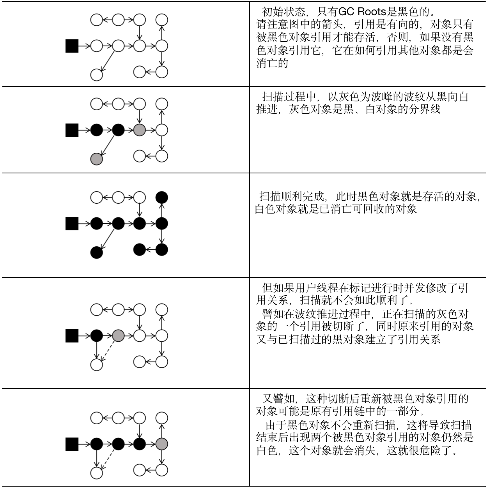

# 垃圾收集器与内存分配策略

## 3.1 概述
- 了解垃圾收集和内存分配的原因：当需要排查各种内存写出、内存泄漏问题时，当垃圾收集器成为系统达到更高并发量的瓶颈时，我们就必须对这些"自动化"的技术实施必要的监控和调节。
- 垃圾收集器关注Java堆和方法区的内存该如何管理。因为Java堆和方法区这两个区域有着很显著的不确定性：一个接口的多个实现类需要的内存可能会不一样，一个方法所执行的不同条件分支所需要的内存也可能不一样，只有处于运行期间，我们才能知道程序究竟会创建哪些对象，创建多少个对象，这部分内存的分配和回收是动态的。

## 3.2 对象已死？
垃圾收集器在对堆进行回收前，第一件事情就是要确定这些对象之中哪些还"存活"着，哪些已经"死去"（"死去"即不可能再被任何途径使用的对象）了。

### 3.2.1 引用计数算法
- Java虚拟机并不是通过引用计数算法来判断对象是否存活的。
- 举个简单的例子，请看代码清单3-1中的testGC方法：对象objA和objB都有字段instance，赋值令objA.instance = objB 及 objB.instance = objA，
除此以外，这两个对象再无任何引用，实际上这两个对象已经不可能再被访问，但是他们因为互相引用着对方，导致他们的引用计数都不为领，引用计数算法也就无法回收它们。
```java

/**
 * testGC()方法执行后，ObjA和ObjB会不会被GC呢？
 */
public class ReferenceCountingGC {
    public Object instance = null;

    private static final int _1MB = 1024 * 1024;

    /**
     * 这个成员属性的唯一意义就是占点内存，以便能在GC日志中看清楚是否有回收过
     */
    private byte[] bigSize = new byte[2 * _1MB];

    public static void testGC() {
        ReferenceCountingGC objA = new ReferenceCountingGC();
        ReferenceCountingGC objB = new ReferenceCountingGC();
        objA.instance = objB;
        objB.instance = objA;

        objA = null;
        objB = null;

        // 假设在这行发生GC，objA和objB是否能被回收？
        System.gc();
    }

    public static void main(String[] args) {
     testGC();
    }
}
```
运行结果：
```text
[GC (System.gc()) [PSYoungGen: 8034K->624K(76288K)] 8034K->632K(251392K), 0.0014423 secs] [Times: user=0.01 sys=0.00, real=0.00 secs] 
[Full GC (System.gc()) [PSYoungGen: 624K->0K(76288K)] [ParOldGen: 8K->394K(175104K)] 632K->394K(251392K), [Metaspace: 3161K->3161K(1056768K)], 0.0045513 secs] [Times: user=0.03 sys=0.00, real=0.01 secs] 
Heap
 PSYoungGen      total 76288K, used 1966K [0x000000076ab00000, 0x0000000770000000, 0x00000007c0000000)
  eden space 65536K, 3% used [0x000000076ab00000,0x000000076aceb9e0,0x000000076eb00000)
  from space 10752K, 0% used [0x000000076eb00000,0x000000076eb00000,0x000000076f580000)
  to   space 10752K, 0% used [0x000000076f580000,0x000000076f580000,0x0000000770000000)
 ParOldGen       total 175104K, used 394K [0x00000006c0000000, 0x00000006cab00000, 0x000000076ab00000)
  object space 175104K, 0% used [0x00000006c0000000,0x00000006c00629d0,0x00000006cab00000)
 Metaspace       used 3173K, capacity 4496K, committed 4864K, reserved 1056768K
  class space    used 349K, capacity 388K, committed 512K, reserved 1048576K
```
从运行结果可以清楚看到内存回收日志中包含"8034K->624K"，意味着虚拟机并没有因为这两个对象互相引用就放弃回收它们，这也从侧面说明了Java虚拟机并不是通过引用计数算法来判断对象是否存活的。

### 3.2.2 可达性分析算法
- 可达性分析算法的基本思路就是通过一系列成为"GC Roots"的根对象作为起始节点集，从这些节点开始，根据引用关系向下搜索，搜索过程所走过的路径称为"引用链"（Reference Chain），如果某个对象到GC Roots间没有任何引用链相连，或者用图论的话来说就是从GC Roots到这个对象不可达时，则证明此对象是不可能再被使用的。
- 如图3-1所示，对象object 5、object 6、object 7虽然互有关联，但是它们到GC Roots都是不可达的，因此它们将会被判定为可回收的对象。

<p style="text-align: center;">图3-1 利用可达性分析算法判定对象是否可回收</p>

在Java技术体系里面，固定可作为GC Roots的对象包括以下几种：
- 在虚拟机栈（栈帧中的本地变量表）中引用的对象，譬如各个线程被调用的方法堆栈中使用到的参数、局部变量、临时变量等。
- 在方法区中类静态属性引用的对象，譬如Java类的引用类型静态变量。
- 在方法区中常量引用的对象，譬如字符串常量（String Table）里的引用。
- 在本地方法栈JNI（即通常所说的Native方法）引用的对象。
- Java虚拟机内部的引用，如基本数据类型对应的Class对象，一些常驻的异常对象（比如NullPointerException、OutOfMemoryException）等，还有系统类加载器。
- 所有被同步锁（sysnchronized关键字）持有的对象。
- 反映Java虚拟机内部情况的JMXBean、JVMTI中注册的回调、本地代码缓存等。
- 根据用户所选用的垃圾收集器以及当前回收的内存区域不同，还可以有其他对象"临时性"地加入。


### 3.2.3 再谈引用
在JDK1.2版之后，Java对引用的概念进行了扩充，将引用分为强引用（Strongly Reference）、软引用（Soft Reference）、弱引用（Weak Reference）和虚引用（Phantom Reference）4种，这4种引用强度依次逐渐减弱。
- 强引用是最传统的"引用"的定义，是指在程序代码之中普遍存在的引用赋值，即类似于"Object obj = new Object（）"这种引用关系。永远不会被垃圾收集器回收。
- 软引用是用来描述一些还有用、但非必须的对象。
- 弱引用也是用来描述那些非必须对象，但是他的强度比软引用更弱一些，被弱引用关联的对象只能生存到下一次垃圾收集发生为止。
- 虚引用也称为"幽灵引用"或者"幻影引用"，它是最弱的一种引用关系。一个对象是否有虚引用的存在，完全不会对其生存时间造成影响，也无法通过虚引用来取得一个对象实例。为一个对象设置虚引用关联的唯一目的只是为了能再这个对象被收集器回收时收到一个系统通知。


### 3.2.4 生存还是死亡？
- 在可达性算法中被判定为不可达对象后，至少要经历两次标记过程对象才会真正死亡：如果对象在进行可达性分析后发现没有与GC Roots相连接的引用链，那它会被第一次标记，随后进行一次筛选，筛选的条件是此对象是否有必要执行finalize()方法。加入对象没有覆盖finalize()方法，或者finalize()方法已经被虚拟机调用过，那么虚拟机将这两种情况都视为"没有必要执行"。
- 如果这个对象呗判定为确有必要执行finalize()方法，那么该对象将会被放置在一个名为F-Queue的队列之中，并在稍后由一条虚拟机自动建立的、低调度优先级的Finalizer线程去执行它们的finalize()方法。finalize()方法是对象逃脱死亡命运的最后一次机会，如果对象在finalize()中重新与引用链上的一个对象建立关联即可避免被回收，譬如把自己（this关键字）赋值给某个类变量或者对象的成员变量。从代码清单3-2中我们可以看到一个对象的finalize()被执行，但是它仍然可以存活。
```java
/**
 * 此代码演示了两点：
 * 1.对象可以在被GC时自我拯救。
 * 2.这种自救的机会只有一次，因为一个 对象的finalize()方法最多只会被系统自动调用一次
 */
public class FinalizeEscapeGC {

    public static FinalizeEscapeGC SAVE_HOOK = null;

    public void isAlive() {
        System.out.println("Yes, I am still alive!");
    }

    @Override
    protected void finalize() throws Throwable {
        super.finalize();
        System.out.println("finalize method is exceted!");
        // 重新建立关联，避免被回收
        SAVE_HOOK = this;
    }

    public static void main(String[] args) throws InterruptedException {
        SAVE_HOOK = new FinalizeEscapeGC();

        // 对象第一次成功拯救自己
        SAVE_HOOK = null;
        System.gc();
        // 因为Finalizer方法优先级很低，暂停0.5秒以等待它
        Thread.sleep(500);
        if (SAVE_HOOK != null) {
            SAVE_HOOK.isAlive();
        } else {
            System.out.println("No, I am dead :(");
        }

        // 下面这段代码和上面的完全相同，但是这次自我拯救失败了
        SAVE_HOOK = null;
        System.gc();
        // 因为Finalizer方法优先级很低，暂停0.5秒以等待它
        Thread.sleep(500);
        if (SAVE_HOOK != null) {
            SAVE_HOOK.isAlive();
        } else {
            System.out.println("No, I am dead :(");
        }
    }
}
```
运行结果：
```text
finalize method is exceted!
Yes, I am still alive!
No, I am dead :(
```
- 从运行结果可以看到finalize()方法被执行，并且只执行了一次，因此第二段代码自救行动失败
- 官方不推荐使用finalize方法。finalize()能做的所有工作，使用try-finally或者其他方法都可以做得更好，更及时。


### 3.2.5 回收方法区
方法区的垃圾收集主要回收两个部分内容：废弃的常量和不再使用的类型。
- 回收废弃常量：一个字符串"java"曾经进入常量池，但是当前系统有没有任何一个字符串对象的值是"java"，换句话说，已经没有任何字符串对象引用常量池中的"java"常量，且虚拟机中也没有其他地方引用这个字面量。如果再这个时候发生内存回收就会被系统清理出常量池。常量池中其他类（接口）、方法、字段的符号引用也与此类似。
- 判断一个类型是否属于"不再被使用的类"需要满足下面三个条件：
  - 该类所有的实例都已经被回收，也就是Java堆中不存在该类及其任何派生子类的实例。
  - 加载该类的类加载器已经被回收。
  - 该类对应的java.lang.Class对象没有在任何地方被引用，无法在任何地方通过反射访问该类的方法。


## 3.3 垃圾收集算法
从如何判定对象消亡的角度出发，垃圾收集算法可以划分为"引用计数式垃圾收集"（Reference Counting GC）和"追踪式垃圾收集"（Tracing GC）两大类，这两类也常备称作"直接垃圾收集"和"间接垃圾收集"。本节所有算法均属于追踪式垃圾收集的范畴。

### 3.3.1 分代收集理论
当前商业虚拟机的垃圾收集器，大多数都遵循了"分代收集"（Generational Collection）的理论进行设计，它建立在两个分代假说之上：
- 1）弱分代假说（Weak Generational Hypothesis）：绝大多数对象都是朝生夕灭的。
- 2）强分代假说（Strong Generational Hypothesis）：熬过越多次垃圾收集过程的对象越难以消亡。<br/>
这两个分代假说共同奠定了多款常用的垃圾收集器的一致设计原则：收集器应该将Java堆划分出不同的区域，然后将回收对象依据其年龄（年龄即对象熬过垃圾收集过程的次数）分配到不同的区域之中存储。显而易见，如果剩下的都是难以消亡的对象，那就把它们集中放在一起，虚拟机便可以使用较低的频率来回收这个区域，这就同时兼顾了垃圾回收的时间开销和内存空间的有效利用。<br/>
在Java堆划分出不同的区域之后，垃圾收集器才可以每次只回收其中某一个或者某些部分的区域——因而才有了"Minor GC" "Major GC" "Full GC"这样的回收类型的划分；也才能够针对不同的区域安排与里面存储对象存亡特征相匹配的垃圾收集算法——因而展示出了"标记-复制算法" "标记-清除算法" "标记-整理算法"等针对性的垃圾收集算法。
- 3）跨代引用假说（Intergenerational Reference Hypothesis）：跨代引用相对于同代来说仅占极少数。
  - 这其实是可根据前两条假说逻辑推理得出的隐含推论：存在互相引用关系的两个对象，是应该倾向于同时生存或者同时消亡的。例如，如果某个新生代对象存在跨代引用，由于老年代对象难以消亡，该引用会使得新生代对象在收集时同样得以存活，进而在年龄增大之后晋升到老年代中，这时跨时代引用也随即被消除了。
  
**注意**<br/>
对于不同分代的名词定义：
- 部分收集（Partial GC）：指目标不是完整收集整个Java堆的垃圾收集，其中又分为：
  - 新生代收集（Minor GC/Yong GC）：指目标只是新生代的垃圾收集。
  - 老年代收集（Major GC/Old GC）：指目标只是老年代的垃圾收集。
  - 混合收集（Mixed GC）：指目标是收集整个新生代以及部分老年代的垃圾收集。目前只有GI收集器会有这种行为。
- 整堆收集（Full GC）：收集整个Java堆和方法区的垃圾收集。 


### 3.3.2 标记-清除算法
- 标记-清除算法是最基础的垃圾收集算法，该算法分为"标记"和"清除"两个阶段：首先标记出所有需要回收的对象，在标记完成后，统一回收掉所有被标记的对象，也可以反过来，标记存活的对象，统一回收所有未被标记的对象。标记过程就是对象是否属于垃圾的判定过程。
- 该算法有两个缺点：
  - 执行效率不稳定，如果Java堆中包含大量对象，而且其中大部分是需要回收的，这时必须进行大量标记和清除的动作，导致标记和清除两个过程的执行效率都随对象数量增长而降低。
  - 内存空间的碎片化问题，标记、清除之后会产生大量不连续的内存碎片，空间碎片太多可能会导致当以后再程序运行过程中需要分配较大对象时无法找到足够的连续内存而不得不提前触发另一次垃圾收集算法。

### 3.3.3 标记-复制算法
标记-复制算法常被称为复制算法，为了解决标记-清除算法面对大量可回收对象时执行效率低的问题。该算法将可用内存按容量划分为大小相等的两块，每次只使用其中的一块。当这一块用完了，就将还存活着的对象复制到另外一块上面，然后再把已使用的内存空间一次清理掉。

### 3.3.4 标记-整理算法
标记-整理算法标记的过程仍然与"标记-清除"算法一样，但后续步骤不是直接对可回收对象进行清理，而是让所有存活的对象都向内存空间一端移动，然后直接清理掉边界以外的内存。<br/>
标记-清理算法与标记-整理算法的本质差异在于前者是一种非移动式的回收算法，而后者是移动式的。


## 3.4 HopSpot的算法细节实现

### 3.4.1 根节点枚举
- 迄今为止，所有收集器在根节点枚举这一步骤都是必须暂停用户线程的，因此毫无疑问根节点枚举与之前提及的整理内存碎片一样会面临相似的"Stop The World"的困扰。
- 由于目前主流Java虚拟机使用的都是准确式垃圾收集，所以当用户线程停顿下来之后，其实并不需要一个不漏的检查完所有执行上下文和全局的引用位置，虚拟机应当是有办法直接得到哪些地方存放着对象引用的。
在HotSpot的解决方案里，是使用一组称为OopMap的数据结构来达到这个目的。一旦类加载动作完成的时候，HotSpot就会把对象内什么偏移量上是什么类型的数据计算出来，在即时编译（见第11章）过程中，也会在特定的位置记录下栈里和寄存器里哪些位置是引用。
这样收集器在扫描时就可以直接得知这些信息了 ，并不需要真正一个不漏地从方法区等GC Roots开始查找。 

### 3.4.2 安全点
- HotSpot没有为每条指令都生成OopMap，因为将会需要大量的额外存储空间，只是在"特定的位置"记录了这些信息，这些位置被称为安全点（Safepoint）。
有了安全点的设定，也就决定了用户程序执行时并非在代码指令流的任意位置都能够停顿下来开始垃圾收集，而是强制要求必须执行到达安全点后才能够暂停。因此，安全点的选定既不能太少以至于让收集器等待时间过长，
也不能太过频繁以至于过分增大运行时的内存负荷。安全点位置的选取基本上是以"是否具有让程序长时间执行的特征"为标准进行选定的，因为每条指令执行的时间都非常短暂，程序不太可能因为指令流长度太长这样的原因而长时间执行，"长时间执行"的最明显特征就是指令序列的复用，
例如方法调用、循环跳转、异常跳转等都属于指令序列复用，所以只有具有这些功能的指令才会产生安全点。
- 对于安全点，另一个需要考虑的问题是，如何在垃圾收集发生时让所有线程都跑到最近的安全点，然后停顿下来。这里有以下两种方案可供选择：
  - 抢先式中断（Preemptive Suspension）：不需要线程的执行代码主动去配合，在垃圾收集发生时，系统首先把所有用户线程全部中断，如果发现有用户线程中断的地方不在安全点上，就恢复这条线程执行，让它一会再重新中断，直到跑到安全点上。
  现在几乎没有虚拟机实现采用抢先式中断来暂停线程响应GC事件。
  - 主动式中断（Voluntary Suspension）：主动式中断的思想是当垃圾收集需要中断线程的时候，不直接对线程操作，仅仅简单地设置一个标志位，各个线程执行过程时会不停地主动去轮询这个标志，一旦发现中断标志为真时就自己在最近的安全点上主动中断挂起。
  轮询标志的地方和安全点是重合的，另外还要加上所有创建对象和其他需要在Java堆上分配内存的地方，这是为了检查是否即将要发生垃圾收集，避免没有足够内存分配新对象。
 
### 3.4.3 安全区域
- 安全点机制保证了程序执行时，在不太长的时间内就会遇到可进入垃圾收集过程的安全点。但是，程序"不执行"的时候呢？所谓的程序不执行就是没有分配处理器时间，典型的场景便是用户线程处于Sleep状态或者Blocked状态，这时候线程无法响应虚拟机的中断请求，
不能再走到安全的地方中断挂起自己，虚拟机也显然不可能持续等待线程重新被激活分配处理器时间。对于这种情况，就必须引入安全区域（Safe Region）来解决。
- 安全区域是指能够确保在某一段代码片段之中，引用关系不会发生变化，因此，在这个区域中任意地方开始垃圾收集都是安全的。我们也可以把安全区域看作被扩展拉伸的安全点。
- 当用户线程执行到安全区域里面的代码时，首先会标识自己已经进入了安全区域，那样当这段时间里虚拟机要发起垃圾收集时就不必去管这些已经申明自己在安全区域内的线程了。当线程要离开安全区域时，
它要检查虚拟机是否已经完成了根节点枚举（或者垃圾收集过程中其他需要暂停用户线程的阶段），如果完成了，那线程就当做没事发生过，继续执行；否则它就必须一直等待，知道收到可以离开安全区域的信号为止。


### 3.4.4 记忆集与卡表
- 讲解分代收集理论的时候，提到了为解决对象跨代引用所带来的问题，垃圾收集器在新生代中建立了名为记忆集（Remembered Set）的数据结构，用以避免把整个老年代加进GC Roots扫描范围。
- 记忆集是一种用于记录从非收集区域指向收集区域的指针集合的抽象数据结构。 在垃圾收集场景中，收集器只需要通过记忆集判断出某一块非收集区域是否存在有指向了收集区域的指针就可以了，并不需要了解这些跨代指针的全部细节。
下面列举了一些可供选择的记录精度：
  - 字长精度：每个记录精确到一个机器字长（就是处理器的寻址位数，如常见的32位或64位，这个精度决定了机器访问物理内存地址的指针长度），该字包含了跨代指针。
  - 对象精度：每个记录精确到一个对象，该对象里有字段含有跨代指针。
  - 卡精度：每个记录精确到一块内存区域，该区域内有对象含有跨代指针。
- 其中，第三种"卡精度"所指的是用一种称为"卡表"（Card Table）的方式去实现记忆集，这也是目前最常用的一种记忆集实现形式。卡表是记忆集的一种具体实现，它定义了记忆集的记录精度、与堆内存的映射关系等。
关于卡表与记忆集的关系，可以按照Java语言中HashMap和Map的关系来类比理解。
- 卡表最简单的形式可以只是一个字节数组，以下这行代码是HotSpot默认的卡表标记逻辑：
```jvm
CARD_TABLE [this address >> 9] = 0;
```
- 字节数组CARD_TABLE的每一个元素都对应着其标识的内存区域中一块特定大小的内存块，这个内存块被称作"卡页"（Card Page）。一般来说，卡页大小都是以2的N次幂的字节数，通过上面代码可以看出HotSpot中使用的卡页是2的9次幂，即512字节（地址右移9位，
相当于用地址除以512）。
- 一个卡页的内存中通常包含不止一个对象，只要卡页内存内有一个（或多个）对象的字段存在着跨代指针，那就将对应卡表的数组元素的值标识为1，称为这个元素变脏（Dirty），没有则标识为0。
在垃圾收集发生时，只要筛选出卡表中变脏的元素，就能轻易得出哪些卡页内存块中包含跨代指针，把它们加入GC Roots中一并扫描。

### 3.4.5 写屏障
- 卡表元素何时变脏的答案是很明确的——有其他分代区域中对象引用了本区域对象时，其对应的卡表元素就应该变脏，变脏时间点原则上应该发生在引用类型字段赋值的那一刻。
- 在HotSpot虚拟机里是通过写屏障（Write Barrier）技术维护表状态的（也就是变脏）。写屏障可以看作在虚拟机层面对"引用类型字段赋值"这个动作的AOP切面，在引用对象赋值时产生一个环形（Around）通知，供程序执行额外的动作，
也就是说赋值的前后都写屏障的覆盖范畴内。在赋值前的部分的写屏障叫作写前屏障（Pre-Write Barrier），在赋值之后的则叫作写后屏障（Post-Write Barrier）。
HotSpot虚拟机的许多收集器都有使用到写屏障，但直至G1收集器之前，其他收集器都只用到了写后屏障。下面这段代码清单 3-6 是一段更新卡表状态的简化逻辑。
```text
void oop_field_store(oop* field, oop new_value) {
  // 引用字段赋值操作
  *field = new_value;
  // 写后屏障，在这里完成卡表状态更新
  post_write_barrier(field, new_value);
}
```  
- 应用写屏障后，虚拟机就会为所有赋值操作生成相应的指令，一旦收集器在写屏障中增加了更新卡表操作，无论更新的是不是老年代对新生代对象的引用，每次只要对引用进行更新，就会产生额外的开销，不过这个开销与Minor GC时扫描整个老年代的代价相比是低得多的。
- 除了写屏障的开销外，卡表在高并发场景下还面临着"伪共享"（False Sharing）问题。伪共享是处理并发底层细节时一种经常需要考虑的问题，现代中央处理器的缓存中是以缓存行（Cache Line）为单位存储的，当多线程修改互相独立的变量时，
如果这些变量恰好共享同一个缓存行，就会彼此影响（写回，无效化或者同步）而导致性能降低，这就是伪共享问题。
- 为了避免伪共享问题，一种简单的解决方案是不采用无条件的写屏障，而是先检查卡表标记，只有当该卡表元素未被标记过时才将其标记为变量，即将卡表更新的逻辑变为以下代码所示：
```text
if (CARD_TABLE [this address >> 9] != 0)
  CARD_TABLE [this address >> 9] = 0;
```

### 3.4.6 并发的可达性分析
- 可达性分析算法理论上要求全过程都基于一个能保障一致性的快照中才能够进行分析，这意味着必须全程冻结用户线程的运行。
在GC Roots往下遍历对象图，这一步骤的停顿时间就必定会与Java堆容量直接成正比例关系：堆越大，存储的对象越多，对象结构越复杂，要标记更多对象而产生的停顿时间要更长。
- 想解决或者降低用户线程的停顿，就要先搞清楚为什么必须在一个能保障一致性的快照上才能进行对象图的遍历？
为了能解释清楚这个问题，这里引入三色标记（Tri-color Marking）作为工具来辅助推导，把遍历对象图过程中遇到的对象，按照"是否访问过"这个条件标记成以下三种颜色：
  - 白色：表示对象尚未被垃圾收集器访问过。虽然在可达性分析刚刚开始的阶段，所有的对象都是白色的，若在粉嫩系结束的阶段，仍然是白色的对象，即代表不可达。
  - 黑色：表示对象已经被垃圾收集器访问过，且这个对象的所有引用都已经扫描过。黑色的对象代表已经扫描过，它是安全存活的，
  如果有其他对象引用指向了黑色对象，无须重新扫描一遍。黑色对象不可能直接（不经过灰色对象）指向某个白色对象。
  - 灰色：表示对象已经被垃圾收集器访问过，但这个对象上至少存在一个引用还没有被扫描过。
- 关于可达性分析的扫描过程，可以看作对象图上一股以灰色为波峰的波纹从黑向白推进的过程，如果用户线程此时是冻结的，只有收集器线程在工作 ，那不会有任何问题。
但如果用户线程与收集器是并发工作的呢？收集器在对象图上标记颜色，同时用户线程在修改引用关系——即修改对象图的结构，这样子可能出现两种后果。
  - 把原本消亡的喜爱那个错误标记为存活，可以容忍。
  - 把原本存活的对象错误标记为已消亡，后果很致命，程序肯定会因此发生错误。下面表3-1演示了这样的致命错误具体如何产生的。 

 表3-1 并发出现“对象”消失问题的示意
- 当且仅当以下两个条件同时满足时，会产生"对象消失"的问题，即原本应该是黑色的对象被误标为白色：
  - 赋值器插入了一条或多条从黑色对象到白色对象的新引用；
  - 赋值器删除了全部从灰色对象到该白色对象的直接或间接引用。
- 破坏以上两个条件任意一个即可以解决并发扫描时的对象消失问题。 由此产生了两种解决方案：增量更新（Incremental Update）和原始快照（Snapshot At The Beginning， SATB）。
- 增量更新要破坏的是第一个条件，当黑色对象插入新的指向白色对象的引用关系时，就将这个新插入的引用记录下来，等并发扫描结束之后，再将这些记录过的引用关系中的黑色对象为根，重新扫描一次。
这可以理解为，黑色对象一旦新插入了指向白色对象的引用，它就变回灰色对象了。
- 原始快照要破坏的是第二个条件，当灰色对象要删除指向白色对象的引用关系时，就将这个要删除的引用记录下来，在并发扫描结束之后，再将这些记录过的引用关系中的灰色对象为根，重新扫描一次。
这也可以理解为，无论引用关系删除与否，都会按照刚刚开始扫描那一刻的对象图快照来进行搜索。
- 以上无论是对引用关系记录的插入还是删除，虚拟机的记录操作都是通过写屏障实现的。


## 3.5 经典垃圾收集器
 
 
### 3.5.1 Serial收集器
- Serial收集器是最基础、历史最悠久的收集器。该收集器是一个单线程工作的收集器，但它的"单线程"的意义并不仅仅是说明它只会使用一个处理器或一条收集线程去完成垃圾收集工作，
更重要的是强调在它进行垃圾收集时，必须暂停其他所有工作线程，直到它收集结束。"Stop The World"这项工作是由虚拟机在后台自动发起和自动完成的，
在用户不可知、不可控的情况下把用户的正常工作的线程全部都停掉，这对很多应用来说都是不可接受的。
- 虽然有着以上的缺点，但它依然是HotSpot虚拟机运行在客户端模式下的默认新生代收集器，有着优于其他收集器的地方，那就是简单而高效（与其他收集器的单线程相比），
对于内存资源受限的环境，它是所有收集器里额外内存消耗（Memory Footprint）最小的；对于单核处理器或处理器核心数较少的环境来说，Serial收集器由于没有线程交互的开销，
专心做垃圾收集自然可以获得最高的单线程收集效率。

### 3.5.2 ParNew收集器
- ParNew收集器实质上是Serial收集器的多线程并行版本，除了同时使用多条线程进行垃圾收集之外，其余的行为包括Serial收集器可用的所有控制参数、收集算法Stop The World、
对象分配规则、回收策略等都与Serial收集器完全一致。

**注意**
- 并行和并发都是并发编程中的专业名词，在谈论垃圾收集器的上下文语境中，它们可以理解为：
  - 并行（Parallel）：并行描述的是多条垃圾收集器线程之间的关系，说明同一时间有多条这样的线程在协同工作，通常默认此时用户线程处于等待状态。
  - 并发（Concurrent）：并发描述的是垃圾收集器与用户线程之间的关系，说明同一时间垃圾收集器线程与用户线程都在运行。由于用户线程并未被冻结，所以线程仍然能响应服务请求，
  但由于垃圾收集器线程占用了一部分系统资源，此时应用程序的处理的吞吐量收到一定影响。
 
### 3.5.3 Parallel Scavenge收集器
- Parallel Scavenge收集器也是一款新生代收集器，它同样是基于标记-复制算法实现的收集器，也是能够并行收集的多线程收集器。
- CMS等收集器的关注点是尽可能地缩短垃圾收集时用户线程的停顿时间，而Parallel Scavenge收集器的目标则是达到一个可控制的吞吐量（Throughput）。所谓吞吐量就是处理器用于运行用户代码的时间与处理器总耗时时间的比值，即：
  - **吞吐量 = 运行用户代码时间 / (运行用户代码时间 + 运行垃圾收集时间)**
- 如果虚拟机完成某个任务，用户代码加上垃圾收集总共耗费了100分钟，其中垃圾收集花掉1分钟，那吞吐量就是99%。停顿时间越短就越适合需要与用户交互或需要保证服务响应质量的程序，
良好的响应速度能提升用户体验；而高吞吐量则可以最高效率地利用处理器资源，尽可能完成程序的运算任务，主要适合在后台运算而不需要太多交互的分析任务。

### 3.5.4 Serial Old收集器
- Serial Old是Serial收集器的老年代版本，它同样是一个单线程收集器，使用标记-整理算法。这个收集器的主要意义也是供客户端模式下的HotSpot虚拟机使用。如果在服务端模式下，它也有可能有两种用途：
一种是在JDK5以及之前的版本中与Parallel Scavenge收集器搭配使用，另一种就是作为CMS收集器发生失败时的后备预案，在并发收集发生Concurrent Mode Failure时使用。

### 3.5.5 Parallel Old收集器
- Parallel Old是Parallel Scavenge收集器的老年代版本，支持多线程并发收集，基于标记-整理算法实现。该收集器是JDK6时才开始提供的。

### 3.5.6CMS收集器
- CMS（Concurrent Mark Sweep）收集器是一种以获取最短回收停顿时间为目标的收集器。CMS收集器是基于标记-清除算法实现的，它的运作过程分为四个步骤，包括： 
  - 1）初始标记（CMS initial mark）
  - 2）并发标记（CMS concurrent mark）
  - 3）重新标记（CMS remark）
  - 4）并发清除（CMSconcurrent sweep）
- 其中初始标记、重新标记这两个步骤仍然需要"Stop The World"。初始标记仅仅只是标记一下GC Roots能直接关联到的对象，速度很快；并发标记阶段就是从GC Roots的直接关联对象开始遍历整个对象图的过程，
这个过程耗时较长但是不需要停顿用户线程，可以与垃圾收集线程一起并发运行；而重新标记阶段则是为了修正并发标记期间，因用户程序继续运作而导致标记产生变动的那一部分对象的标记记录，
这个阶段的停顿时间通常会比初始标记阶段稍长一些，但也远比并发标记阶段的时间短；最后是并发清除阶段，清理删除掉标记阶段判断的已经死亡的对象，由于不需要移动存活对象，所以这个阶段也是可以与用户线程同时并发的。
- CMS收集器至少有以下三个明显的缺点：
  - 首先，CMS收集器对处理器资源非常敏感。在并发阶段，它虽然不会导致用户线程停顿，但却会因为占用了一部分线程（或者说处理器的计算器的计算能力）而导致应用程序变慢，降低总吞吐量。
  CMS默认启动的回收线程数是（处理器核心数量+3）/4，也就是说，当处理器核心数量不足4个时，CMS对用户程序的影响就可能变得很大。如果应用程序本来的处理器负载就很高，
  还要分出一半的运算能力去执行收集器线程，就可能导致用户程序的执行速度忽然大幅降低。为了缓和这种情况，虚拟机提供了一种称为"增量式并发收集器"的CMS收集器变种，在并发标记、清理的时候让收集器线程、
  用户线程交替运行，尽量减少垃圾收集线程的独占资源的时间。
  - 然后，由于CMS收集器无法处理"浮动垃圾"（Floating Grabage），有可能出现"Concurrent Mode Failure"失败进而导致另一次完全"Stop The World"的Full GC的产生。在CMS的并发标记和并发清理阶段，
  用户线程是还在继续运行的，程序在运行自然就还会伴随着有新的垃圾对象不断产生，但这一部分垃圾对象是出现在标记过程结束以后，CMS无法在当次收集中处理掉它们，只好留待下一次垃圾收集时再清理掉。这一部分垃圾就称为"浮动垃圾"。
  - 最后，CMS是一款基于"标记-清除"算法实现的收集器，这意味着收集结束时会有大量空间碎片产生。空间碎片过多时，将会给大对象分配带来很大麻烦，往往会出现老年代还有很多剩余空间，
  但就是无法找到足够大的连续空间来分配当前对象，而不得不提前触发一次Full GC的情况。

### 3.5.7Grabage First收集器  
- Garbage First（简称G1）收集器是垃圾收集器技术发展历史上的里程碑式的成果，它开创了收集器面向局部收集的设计思路和基于Region的内存布局形式。G1是一款主要面向服务端应用的垃圾收集器。
- 作为CMS收集器的替代者和继承人，设计者们希望做出一款能够建立起"停顿时间模型"（Pause Prediction Model）的收集器，停顿时间模型的意思是能够支持指定在一个长度为M毫秒的时间片段内，
消耗在垃圾收集上的时间大概率不超过N毫秒这样的目标，这几乎已经是实时Java（RTSJ）的中软实时垃圾收集器特征了。
- 具体要实现这个目标，首先要有一个思想上的改变，在G1收集器出现之前的所有其他收集器，包括CMS在内，垃圾收集的目标范围要么是整个新生代（Minor GC），要么就是整个老年代（Major GC），
再要么就是整个Java堆（Full GC）。而G1跳出了这个樊笼，它可以面向堆内存任何部分来组成回收集（Collection Set，一般简称CSet）进行回收，衡量标准不再是它属于哪个分代，
而是哪块内存中存放的垃圾数量最多，回收效益最大，这就是G1收集器的Mixed GC模式。
- G1开创的机油Region的堆内存布局是它能够实现这个目标的关键。虽然G1也仍是遵循分代收集理论设计的，但其堆内存的布局与其他收集器有非常明显的差异：G1不再坚持固定大小以及固定数量的分代区域划分，
而是把连续的Java堆划分为多个大小相等的独立区域（Region），每一个Region都可以根据需要，扮演新生代的Eden空间、Survivor空间或者老年代空间。收集器能够对扮演不同角色的Region采用不同的策略去处理，
这样无论是新创建的对象还是已经存活了一段时间、熬过多次收集的旧对象都能获取很好的收集效果。
- Region中还有一类特殊的Humongous区域，专门用来存储大对象。G1认为只要大小超过一个Region容量一半的对象即可判定为大对象。每个Region的大小可以通过参数-XX:G1HeapRegionSize设定，
取值范围为1MB~32MB，且应为2的N次幂。而对于那些超过了整个Region容量的超级大对象，将会被存放在N个连续的Humongous Region之中，G1的大多数行为都把Humongous Region作为老年代的一部分进行看待。
- 虽然G1仍然保留新生代和老年代的概念，但新生代和老年代不再是固定的了，它们都是一系列区域（不需要连续）的动态集合。G1收集器之所以能建立可预测的停顿时间模型，是因为它将Region作为单次回收的最小单元，
即每次收集到的内存空间都是Region大小的整倍数，这样可以有计划地避免在整个Java堆中进行全区域的垃圾收集。更具体的处理思路是让G1收集器去跟踪各个Region里面的垃圾堆积的"价值"大小，
价值即回收所获得的空间大小以及回收所需时间的经验值，然后在后台维护一个优先级列表，每次根据用户设定允许的收集停顿时间优先处理回收价值最大的那些Region，这也就是"Garbage First"名字的由来。
这种使用Region划分内存空间，以及具有优先级的区域回收方式，保证了G1收集器在有限的时间内获取尽可能的收集效率。
- 如果不去计算用户线程运行过程中的动作（如使用写屏障维护记忆集的操作），G1收集器的运作过程大致可划分为以下四个步骤：
  - 初始标记（Initial Marking）：仅仅只是标记一下GC Roots能直接关联到的对象，并且修改了TAMS（Top at Mark Start）指针的值，让下一阶段用户线程并发运行时，能正确地在可用的Region中分配新对象。
  这个阶段需要停顿线程，但耗时很短，而且是借用进行Minor GC的时候同步完成的，所以G1收集器在这个阶段实际并没有额外的停顿。
  - 并发标记（Concurrent Marking）：从GC Root开始对堆中对象进行可达性分析，递归扫描整个堆里的对象图，找出要回收的对象，这阶段耗时较长，但可与用户程序并发执行。
  当对象图扫描完成以后，还要重新处理STAB记录下来的在并发时有引用变动的对象。
  - 最终标记（Final Marking）：对用户线程做另一个短暂暂停，用于处理并发阶段结束后仍遗留下来的最后那少量的SATB记录。
  - 筛选回收（Live Data Counting and Evacuation）：负责更新Region的统计数据，对各个Region的回收价值和成本进行统计数据，对各个Region的回收价值和成本进行排序，
  根据用户所期望的停顿时间来制定回收计划，可以自由选择任意多个Region构成回收集，然后把决定回收的那一部分Region的存活对象复制到空的Region中，再清理掉整个旧Region的全部空间。
  这里的操作涉及存活的对象的移动，是必须暂停用户线程，由多条收集器线程并行完成的。
- 与CMS的"标记-清除"算法不同，G1从整体来看是基于"标记-整理"算法实现的收集器，但从局部（两个Region之间）上看是基于"标记-复制"算法实现，无论如何，这两种算法都意味着G1运作期间不会产生内存空间碎片，
垃圾收集完成之后能提供规整的可用内存。这种特性有利于程序长时间运行，在程序为大对象分配内存时不容易因无法找到连续内存空间而提前触发下一次收集。


## 3.6 低延迟垃圾收集器
- 衡量垃圾收集器的三项最重要的指标是：内存占用（Footprint）、吞吐量（Throughput）和延迟（Latency），三者共同构成了一个“不可能三角”。
- 在这三项指标中，延迟的重要性日益凸显，越备受关注。其原因是硬件规格提升，准确地说是内存的扩大，吞吐量会更高，但对延迟反而会带来负面的效果，这点也是很符合直观思维：虚拟机要回收完整的1TB的堆内存，毫无疑问要比回收1GB的对内容耗费更多时间。

### 3.6.1 Shenandoah收集器
- Shenandoah收集器的工作过程大致可以划分为以下九个阶段。（在最新版本的Shenandoah2.0中，进一步强化了“部分收集”的特性，
初始标记之前还有Initial Partial、Concurrent Partial和Final Partial阶段，他们可以不太严谨地理解为对应于以前分代收集中的Minor GC的工作）：
  - 初始标记（Initial Marking）：与G1一样，首先标记与GC Roots直接关联的对象，这个阶段仍是“Stop The World”的，但停顿时间与堆大小无关，只有与GC Roots的数量相关。
  - 并发标记（Concurrent Marking）：与G1一样，遍历对象图，标记出全部可达的对象，这个阶段是与用户线程一起并发的，时间长短取决于堆中存活对象的数量以及对象图的结构复杂度。
  - 最终标记（Final Marking）：与G1一样，处理剩余的SATB扫描，并在这个阶段统计出回收截止最高的Region，将这些Region构成一组回收集（Collection Set）。
  最终标记阶段也会有一小段短暂的停顿。
  - 并发清理（Concurrent Cleanup）：这个阶段用于清理那些整个区域内连一个存活对象都没有找到的Region（这类Region被称为Immediate Garbage Region）。
  - 并发回收（Concurrent Evacuation）：并发回收阶段是Shenandoah与之前的HotSpot中其他收集器的核心差异。在这个阶段，
  Shenandoah要把回收集里面的存活对象先复制一份到其他未被使用的Region之中。复制对象这件事情如果将用户线程冻结起来再做是相当简单的，
  但如果两者必须同时并发进行的话，就会变得复杂起来了。其困难点是在移动对象的同时，用户线程仍然可能不停对被移动的对象进行读写访问，移动对象是一次性的行为，
  但移动之后整个内存中所有指向该对象的引用都还是旧对象的地址，这是很难一瞬间全部改变过来的。对于并发回收阶段遇到的这些困难，
  Shenandoah将会通过读屏障和被称为“Brooks Points”的转发指针来解决。并发回收阶段运行的时间长短取决于回收集的大小。
  - 初始引用更新（Initial Update Reference）：并发回收阶段复制对象结束后，还需要把堆中所有指向旧对象的引用修正到复制后的新地址，
  这个操作称为引用更新。引用更新的初始化阶段实际上并未做出什么具体的处理，设立这个阶段只是为了建立一个线程集合点，
  确保所有并发回收阶段中进行的收集器线程都已完成分配给它们的对象移动任务而已。初始引用更新时间很短，会产生一个非常短暂的停顿。
  - 并发引用更新（Concurrent Update Reference）：真正开始进行引用更新操作，这个阶段是与用户线程一起并发的，时间长短取决于内存中涉及的引用数量的多少。
  并发引用更新与并发标记不同，它不再需要沿着对象图来搜索，只需要按照内存物理地址的顺序，线性地搜索出引用类型，把旧值改为新值即可。
  - 最终引用更新（Final Update Reference）：解决了堆中的引用更新后，还要修正存在于GC Roots中的引用。这个阶段是Shenandoah的最后一次停顿，
  停顿时间只与GC Roots的数量相关。
  - 并发清理（Concurrent Cleanup）：经过并发回收和引用更新之后，整个回收集中所有的Region已再无存活对象，这些Region都变成了Immediate Garbage Regions了，
  最后再调用一次并发清理过程来回收这些Region的内存空间，供以后新对象分配使用。


### 3.6.2 ZGC收集器
- 首先从ZGC的内存布局说起。与Shenandoah和G1一样，ZGC也采用基于Region的堆内存布局，但与它们不同的是，ZGC的Region具有动态性——动态创建和销毁，
以及动态的区域容量大小。在x64硬件平台下，ZGC的Region可以具有大、中、小类容量：
  - 小型Region（Small Region）：容量固定为2MB，用于放置小于256KB的小对象。
  - 中型Region（Medium Region）：容量固定为32MB，用于放置大于等于256KB但小于4MB的对象。
  - 大型Region（Large Region）：容量不固定，可以动态变化，但必须为2MB的整数倍，用于放置4MB或以上的大对象。
- 对于并发整理算法的实现，ZGC收集器采用染色指针技术。染色指针是一种直接将少量额外的信息存储在指针上的技术。
- 尽管Linux下64位指针的高18位不能用来寻址，但剩余的46位指针所能支持的64TB内存在今天仍然能够充分满足大型服务器的需要。鉴于此，ZGC的染色指针技术将这剩下的46位指针宽度，
将其高4位提取出来存储四个标志信息。通过这些标志位，虚拟机可以直接从指针中看到其引用对象的三色标记状态、是否进入了重分配集（即被移动过）、是否只能通过finalize()方法才能被访问到。
- 染色指针的三大优势：
  - 染色指针可以使得一旦某个Region的存活对象被移走之后，这个Region立即就能够被释放和重用掉，而不必等待整个堆中多有指向该Region的引用都被修正后才能清理。
  - 染色指针可以大幅减少在垃圾收集过程中内存屏障的使用数量，设置内存屏障，尤其是写屏障的目的通常是为了记录对象引用的变动情况，如果将这些信息直接维护在指针中，
  显然就可以省去一些专门的记录操作。
  - 染色指针可以作为一种可扩展的存储结构用来记录更多与对象标记、重定向过程相关的数据，以便日后更进一步提高性能。
- ZGC的运作过程大致可划分为以下四个大的阶段。全部四个阶段都是可以并发执行的，仅是两个阶段中间会存在短暂的停顿小阶段，这些小阶段，譬如初始化GC Root直接关联对象的Mark Start，
与之前的G1和Shenandoah的Initial Mark阶段并没有什么差异。
  - 并发标记（Concurrent Mark）：与G1、Shenandoah一样，并发标记是遍历对象图做可达性分析的阶段，前后也要经过类似于G1、Shenandoah的初始标记、最终标记的短暂停顿。不同的是，
  ZGC的标记是在指针上而不是在对象上进行的，标记阶段会更新染色指针中的Marked 0，Marked 1标志位。
  - 并发预备重分配（Concurrent Prepare for Replace）：这个阶段需要根据特定的查询条件统计得出本次收集过程中要清理哪些Region，将这些Region组成重分配集（Relocation Set）。
  ZGC每次回收都会扫描所有的Region，用范围更大的扫描成本换取省去G1中记忆集的维护成本。因此，ZGC的重分配集只是决定了里面存放对象会被重新复制到其他的Region中，里面的Region会被释放，
  而不能说回收行为就只是针对这个集合里面的Region进行，因为标记过程是针对全堆的。此外，在JDK12的ZGC中开始支持的类卸载以及弱引用的处理，也是在这个阶段完成的。
  - 并发重分配（Concurrent Relocate）：重分配是ZGC执行过程中的核心阶段，这个过程要把重分配集中的存货对象复制到新的Region上，并为重分配集中的每个Region维护一个转发表（Forward Table），
  记录从旧对象到新对象的转向关系。得益于染色指针的支持，ZGC收集器能仅从引用上就明确得知一个对象是否处于重分配集之中，如果用户线程此时并发访问了位于重分配集中的对象，
  这次访问将会被预置的内存屏障所截获，然后立即根据Region上的转发表记录将访问转发到新复制的对象上，并同时修正更新该引用的值，使其直接引用新对象，
  ZGC将这种行为称为指针的“自愈”（Self-Healing）能力。这样做的好处是只有第一次访问旧对象会陷入转发，也就是只慢一次，对比Shenandoah的Brooks转发指针，
  那就是每次对象访问都必须付出的固定开销，简单地说就是每次都慢，因此ZGC对用户程序的运行时负载要比Shenandoah来得更低一些。还有另外一个直接的好处是由于染色指针的存在，
  一旦重分配集中某个Region的存活对象都复制完毕后，这个Region就可以立即释放用于新对象的分配（但是转发还得留着不能释放掉），
  哪怕堆中还有很多指向这个对象的未更新指针也没有关系，这些旧指针一旦被使用，它们都是可以自愈的。
  - 并发重映射（Concurrent Remap）：重映射所做的就是修正整个堆中指向重分配集中旧对象的所有引用，这一点可从目标角度看是与Shenandoah并发引用更新阶段一样的，
  但是ZGC的并发重映射并不是一个必须要“迫切”去完成的任务，因为前面说过，即使是旧引用，它也是可以自愈的，最多只是第一次使用时多一次转发和修正操作。
  重映射清理这些旧引用的主要目的是为了不变慢（还有清理结束后可以释放转发表这样的附带收益），所以说这并不是很“迫切”。因此，ZGC很巧妙地把并发重映射阶段要做的工作，
  合并到了下一次垃圾收集循环中的并发标记阶段里去完成，反正它们都是要遍历所有对象的，这样合并就节省了一次遍历对象图的开销。
  一旦所有指针都被修正之后，原来记录新旧对象关系的转发表就可以释放掉了。
  
 
 
## 3.7 选择合适的垃圾收集器
 
 
### 3.7.1 Epsilon收集器
- Epsilon可以形容为"自动内存管理子系统"。一个垃圾收集器除了垃圾收集这个本职工作之外，它还需要负责堆的管理与布局、对象分配、与解释器的协作、
与编译器的协作、与监控子系统协作等职责，其中至少堆的管理和对象的分配这部分功能是Java虚拟机能够正常运作的必要支持，是一个最小化功能的垃圾收集器也必须实现的内容。
- 近年来大型系统从传统单体应用向微服务化、无服务化方向发展的趋势已越发明显，Java在这方面比起Golang等后起之秀确实有一些先天不足，使用率正渐渐下降。
为了应对新的技术潮流，最近几个版本的JDK逐渐加入了提前编译、面向应用的类数据共享等支持。Epsilon也是有着类似的目标，如果读者的应用只要运行数分钟甚至数秒，
只要Java虚拟机能正确分配内存，在堆内存之前就会退出，那显然运行负载极小、没有任何回收行为的Epsilon便是很恰当的选择。


### 3.7.2 收集器的权衡
- 如何选择一款适合自己应用的收集器？该答案主要受以下三个因素影响：
  - 应用程序的关注点是什么？如果是数学分析、科学计算类的任务，目标是能尽快算出结果，那吞吐量就是主要关注点；如果是SLA应用，延迟是主要关注点；
  如果是客户端应用或者嵌入式应用，那垃圾收集的内存占用则是不可忽视的。
  - 运行以你应用的基础设施如何？譬如硬件规格，要设计的系统是x86-32/64、SPARC还是其他；处理器的数量多少，分配内存的大小；选择的操作系统等。
  - 使用JDK的发行商是什么？版本号是多少？该JDK对应了《Java虚拟机规范》的哪个版本？
- 一般来说，收集器的选择就从以上几个点出发来考虑。举个例子，假设某个直接面向用户提供服务的B/S系统准备选择垃圾收集器，
一般来说延迟时间是这类应用的主要关注点，那么：
  - 如果你有充足的预算但没有太多调优经验，那么一套带商业技术的专有硬件或者软件解决方案是不错的选择，Azul公司以前主推的Vega系统和现在主推的Zing VM是这方面的代表，
  这样你就可以使用传说中的C4收集器了。
  - 如果你虽然没有足够预算去使用商业解决方案，但能够掌控软硬件型号，使用较新的版本，同时有特别注重延迟，那ZGC很值得尝试。
  - 如果你对还处于试验状态的收集器的稳定性有所顾虑，或者应用必须运行在Windows操作系统下，那ZGC就无缘了，试试Shenandoah吧。
  - 如果你接手的是遗留系统，软硬件基础设施和JDK版本都比较落后，那就根据内存规模衡量一下，对于大概4GB到6GB以下的堆内存，CMS一般能处理得比较好，
  而对于更大的堆内存，可重点考擦以下G1.
- 当然，以上都是仅从理论出发的分析，实战中切不可纸上谈兵，根据系统实施情况去测试才是选择收集器的最终依据。
 
 
### 虚拟机及垃圾收集器日志
- 在JDK9后，HotSpot提供统一的日志处理框架，HotSpot所有功能的日志都放到了"-Xlog"的参数上，这个参数的能力也相应被极大扩展了。
```text
-Xlog[:[selector][:[output][:[decorators][:output-options]]]]
```
- 命令中最关键的参数是选择器（Selector），它由标签（Tag）和日志级别（Level）共同组成。标签可理解为虚拟机中某个功能模块的名字，
它告诉日志框架用户希望得到虚拟机哪些功能的日志输出。垃圾收集器的标签名称为"gc"，由此可见，垃圾收集器日志只是HotSpot众多功能日志的其中一项。
- 日志级别从低到高，共有Trace，Debug，Info，Warning，Error，Off六种级别，日志级别决定了输出信息的详细程度，默认级别为Info，
HotSpot的日志规则与Log4j，SLF4j这类Java日志框架大体上是一致的。另外，还可以使用修饰器（Decorator）来要求每行日志输出都附加上额外的内容，
支持附加在日志上的信息包括：
  - time：当前日期和时间。
  - uptime：虚拟机启动到现在经过的时间，以秒为单位。
  - timemillis：当前时间的毫秒数，相当于System.currentTimeMillis()的输出。
  - uptimemillis：虚拟机启动到现在经过的毫秒数。
  - timenanos：当前时间的纳秒数，相当于System.nanoTime()的输出。
  - uptimenanos：虚拟机启动到现在经过的纳秒数。
  - pid：进程ID。
  - tid：线程ID。
  - level：日志级别。
  - tags：日志输出的标签集。
- 如果不指定，默认值是uptime、level、tags这三个。
- 下面举几个例子，展示在JDK9统一日志框架前、后是如何获得垃圾收集器过程的相关信息，以下均已JDK9的G1收集器（JDK9下默认收集器就是G1，
所以命令行中没有指定收集器）为例。
  - 1）查看GC基本信息，在JDK9之前使用-XX:+PrintGC，JDK9之后使用-Xlog:gc。
  - 2）查看GC详细信息。


