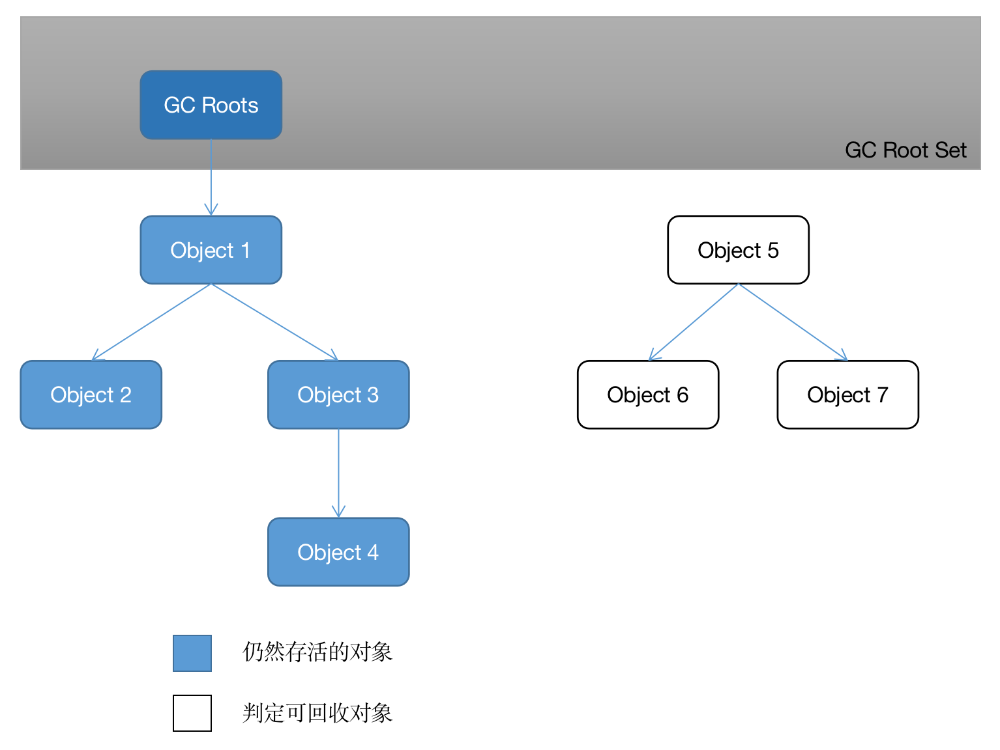

# 垃圾收集器与内存分配策略

## 3.1 概述
- 了解垃圾收集和内存分配的原因：当需要排查各种内存写出、内存泄漏问题时，当垃圾收集器成为系统达到更高并发量的瓶颈时，我们就必须对这些"自动化"的技术实施必要的监控和调节。
- 垃圾收集器关注Java堆和方法区的内存该如何管理。因为Java堆和方法区这两个区域有着很显著的不确定性：一个接口的多个实现类需要的内存可能会不一样，一个方法所执行的不同条件分支所需要的内存也可能不一样，只有处于运行期间，我们才能知道程序究竟会创建哪些对象，创建多少个对象，这部分内存的分配和回收是动态的。

## 3.2 对象已死？
垃圾收集器在对堆进行回收前，第一件事情就是要确定这些对象之中哪些还"存活"着，哪些已经"死去"（"死去"即不可能再被任何途径使用的对象）了。

### 3.2.1 引用计数算法
- Java虚拟机并不是通过引用计数算法来判断对象是否存活的。
- 举个简单的例子，请看代码清单3-1中的testGC方法：对象objA和objB都有字段instance，赋值令objA.instance = objB 及 objB.instance = objA，
除此以外，这两个对象再无任何引用，实际上这两个对象已经不可能再被访问，但是他们因为互相引用着对方，导致他们的引用计数都不为领，引用计数算法也就无法回收它们。
```java

/**
 * testGC()方法执行后，ObjA和ObjB会不会被GC呢？
 */
public class ReferenceCountingGC {
    public Object instance = null;

    private static final int _1MB = 1024 * 1024;

    /**
     * 这个成员属性的唯一意义就是占点内存，以便能在GC日志中看清楚是否有回收过
     */
    private byte[] bigSize = new byte[2 * _1MB];

    public static void testGC() {
        ReferenceCountingGC objA = new ReferenceCountingGC();
        ReferenceCountingGC objB = new ReferenceCountingGC();
        objA.instance = objB;
        objB.instance = objA;

        objA = null;
        objB = null;

        // 假设在这行发生GC，objA和objB是否能被回收？
        System.gc();
    }

    public static void main(String[] args) {
     testGC();
    }
}
```
运行结果：
```text
[GC (System.gc()) [PSYoungGen: 8034K->624K(76288K)] 8034K->632K(251392K), 0.0014423 secs] [Times: user=0.01 sys=0.00, real=0.00 secs] 
[Full GC (System.gc()) [PSYoungGen: 624K->0K(76288K)] [ParOldGen: 8K->394K(175104K)] 632K->394K(251392K), [Metaspace: 3161K->3161K(1056768K)], 0.0045513 secs] [Times: user=0.03 sys=0.00, real=0.01 secs] 
Heap
 PSYoungGen      total 76288K, used 1966K [0x000000076ab00000, 0x0000000770000000, 0x00000007c0000000)
  eden space 65536K, 3% used [0x000000076ab00000,0x000000076aceb9e0,0x000000076eb00000)
  from space 10752K, 0% used [0x000000076eb00000,0x000000076eb00000,0x000000076f580000)
  to   space 10752K, 0% used [0x000000076f580000,0x000000076f580000,0x0000000770000000)
 ParOldGen       total 175104K, used 394K [0x00000006c0000000, 0x00000006cab00000, 0x000000076ab00000)
  object space 175104K, 0% used [0x00000006c0000000,0x00000006c00629d0,0x00000006cab00000)
 Metaspace       used 3173K, capacity 4496K, committed 4864K, reserved 1056768K
  class space    used 349K, capacity 388K, committed 512K, reserved 1048576K
```
从运行结果可以清楚看到内存回收日志中包含"8034K->624K"，意味着虚拟机并没有因为这两个对象互相引用就放弃回收它们，这也从侧面说明了Java虚拟机并不是通过引用计数算法来判断对象是否存活的。

### 3.2.2 可达性分析算法
- 可达性分析算法的基本思路就是通过一系列成为"GC Roots"的根对象作为起始节点集，从这些节点开始，根据引用关系向下搜索，搜索过程所走过的路径称为"引用链"（Reference Chain），如果某个对象到GC Roots间没有任何引用链相连，或者用图论的话来说就是从GC Roots到这个对象不可达时，则证明此对象是不可能再被使用的。
- 如图3-1所示，对象object 5、object 6、object 7虽然互有关联，但是它们到GC Roots都是不可达的，因此它们将会被判定为可回收的对象。

<p style="text-align: center;">图3-1 利用可达性分析算法判定对象是否可回收</p>