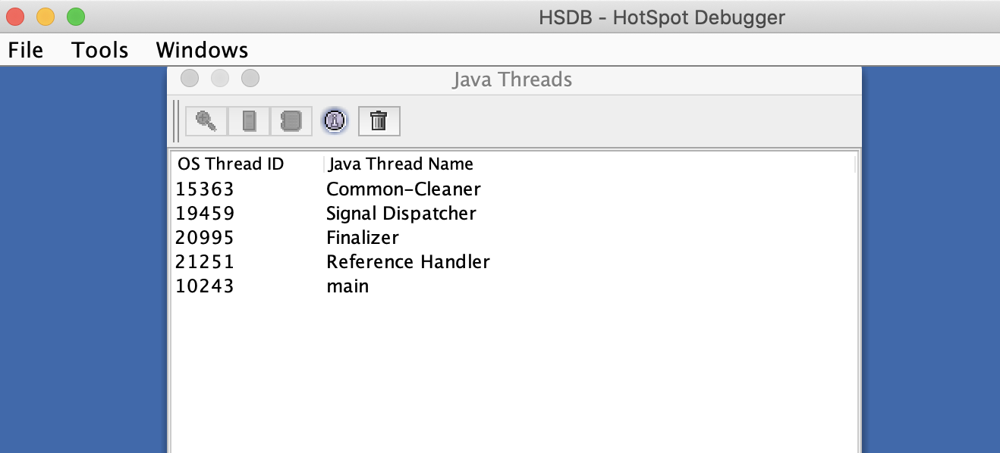
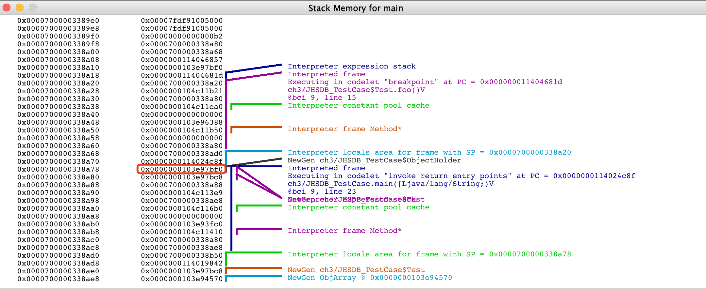

# 第4章 虚拟机性能监控、故障处理工具

## 4.1 概述
- 给一个系统定位问题的时候，知识、经验是关键基础，数据是依据，工具是运用知识处理数据的手段。这里说的数据包括但不限于异常堆栈、虚拟机运行日志、
垃圾收集器日志、线程快照（threaddump/javacore文件）、堆转储快照（heapdump/hrof文件）等。恰当地使用虚拟机故障处理、分析的工具可以提升我们分析数据、
定位并解决问题的效率。

## 4.2 基础故障处理工具
- 在JDK的bin目录下有各种小工具，这些主要是用于监视虚拟机运行状态和进行故障处理的工具，根据软件可用性和授权不同，可以把它们划分为三类：
  - 商业授权工具：主要是JMC（Java Mission Control）及它要使用到的JFR（Java Flight Recorder）。
  - 正式支持工具：这一类是属于被长期支持的工具。
  - 实验性工具：这一类工具在它们使用说明中被声明为"没有技术支持，并且是实验性质的"产品，日后可能会转正，也可能会在某个JDK版本中无声无息地消失。
  但事实上它们通常都非常稳定而且功能强大，也能在处理应用程序性能问题、定位故障时发挥很大作用。
  
### 4.2.1 jps：虚拟机进程状况工具
- jps:可以列出正在运行的虚拟机进程，并显示虚拟机执行主类（Main Class，main()函数所在的类）名称以及这些进程的本地虚拟机唯一ID（LVMID，
Local Virtual Machine Identifier）。
- jps命令格式
```text
jps [ options ] [ hostid ]
```
jps执行样例
jps -l
```text
jps -l                                                                                                                                                                                                                                
1177 org.jetbrains.idea.maven.server.RemoteMavenServer36
1481 jdk.jcmd/sun.tools.jps.Jps
1147 
```
- jps还可以通过RMI协议查询开启了RMI服务的远程虚拟机进程状态，参数hostid为RMI注册表中注册的主机名。


### 4.2.2 jstat：虚拟机统计信息监视工具
- jstat(JVM Statistics Monitoring Tool)是用于监视虚拟机各种运行状态信息的命令行工具。它可以显示本地或者远程虚拟机进程中的类加载、内存、
垃圾收集、即时编译等运行时数据，在没有GUI图形界面、只提供了纯文本控制台环境的服务器上，它将是运行期定位虚拟机性能问题的常用工具。
- jstat命令格式为：
```text
jstat [ option vmid [interval[s|ms] [count]] ]
```
- 对于命令格式中的VMID与LVMID需要特别说明一下：如果是本地虚拟机进程，VMID与LVMID是一致的；如果是远程虚拟机进程，那VMID的格式应当是：
```text
[protocol:][//]lvmid[@hostname[:port]/servername]
```
- 参数interval和count代表查询间隔和次数，如果省略这2个参数，说明只查询一次。假设需要每250毫秒查询一次进程2764垃圾收集情况，一共查询20次，
那命令应当是：
```text
jstat -gc 2764 250 20
```
- 选项option代表用户希望查询的虚拟机信息，主要分为三类：类加载、垃圾收集、运行期编译状况。
- jstat执行样例
```text
jstat -gcutil 7304
  S0     S1     E      O      M     CCS    YGC     YGCT    FGC    FGCT    CGC    CGCT     GCT   
  0.00  44.06  39.52  70.35  93.62  88.93    103    0.644    12    0.322     -        -    0.966
```
- 查询结果表明：该进程的新生代Eden（E，表示Eden）使用了39.52%的空间，2个Survivor区（S0、S1，表示Survivor0、Survivor1）分别使用了0和44.06%的空间。
老年代（O，表示 Old）使用了70.35%的空间。程序运行以来共发生Minor GC（YGC，表示Yong GC）16次，总耗时0.644秒；发生Full GC（FGC，表示Full GC）12次，
总耗时（FGCT，表示Full GC Time）为0.322秒；所有GC总耗时（GCT，表示 GC Time）为0.966秒。


### 4.2.3 jinfo：Java配置信息工具 
- jinfo（Configuration Info for Java）的作用是实时查看和调整虚拟机各项参数。jinfo的-flag选项可以查看虚拟机启动时未被显式指定的参数的系统默认值。
jinfo还可以使用-sysprops选项把虚拟机进程的System.getProperties()的内容打印出来。
- jinfo命令格式：
```text
jinfo [ option ] pid
```
- 执行样例：查询CMSInitiatingOccupancyFraction参数值
```text
jinfo -flag CMSInitiatingOccupancyFraction 7304
-XX:CMSInitiatingOccupancyFraction=-1
```

### 4.2.4 jmap：Java内存映像工具
- jmap（Memory Map for Java）命令用于生成堆转储快照（一般称为heapdump或dump文件）。jmap还可以查询finalize执行队列、Java堆和方法区的详细信息，
如空间使用率、当前用的是哪种收集器等。
- jmap命令格式：
```text
jmap [ option ] vmid
```
- 执行样例：
```text
jmap -dump:format=b,file=idea.bin 7304                                                                                                                                                                       [2d5h7m] ✹ ✭
Heap dump file created
```


### 4.2.5 jhat：虚拟机堆转储快照分析工具
- JDK提供jhat（JVM Heap Analysis Tool）命令与jmap搭配使用，来分析jmap生成的堆转储快照。jhat内置了一个微型的HTTP/Web服务器，
生成的堆转储快照的分析结果后，可以在浏览器查看。
- 使用jhat分析dump文件
```text
jhat idea.bin
Reading from idea.bin...
Dump file created Mon Mar 23 23:39:03 CST 2020
Snapshot read, resolving...
Resolving 2817601 objects...
Chasing references, expect 563 dots......
Eliminating duplicate references.......
Snapshot resolved.
Started HTTP server on port 7000
Server is ready.
```
- 屏幕显示"Server is ready."的提示后，用户在浏览器中输出http://localhost:7000/可以看到分析结果。


### 4.2.6 jstack：Java堆栈跟踪工具
- jstack（Stack Trace for Java）命令用于生成虚拟机当前时刻的线程快照（一般称为threaddump或者javacore文件）。
线程快照就是当前虚拟机内每一条线程正在执行的方法堆栈的集合，生成线程快照的目的通常是定位线程出现长时间停顿的原因，如线程间死锁、死循环、
请求外部资源导致的长时间挂起等，都是导致线程长时间停顿的常见原因。线程出现停顿时通过jstack来查看各个线程的调用堆栈，
就可以获知没有响应的线程到底在后台做些什么事情，或者等待着什么资源。
- jstack命令格式：
```text
jstack [ option ] vmid
```
- 
- 代码清单4-4 使用jstack查看线程堆栈（部分结果）
```text
jstack -l 6275                                                              ⏎
2020-03-26 22:43:04
Full thread dump OpenJDK 64-Bit Server VM (25.152-b39 mixed mode):

"rebel-notifications-queue-1" #57 daemon prio=5 os_prio=31 tid=0x00007ff24a70a000 nid=0x959f waiting on condition [0x0000700009845000]
   java.lang.Thread.State: TIMED_WAITING (parking)
	at sun.misc.Unsafe.park(Native Method)
	- parking to wait for  <0x00000007a59095c0> (a java.util.concurrent.locks.AbstractQueuedSynchronizer$ConditionObject)
	at java.util.concurrent.locks.LockSupport.parkNanos(LockSupport.java:215)
	at java.util.concurrent.locks.AbstractQueuedSynchronizer$ConditionObject.awaitNanos(AbstractQueuedSynchronizer.java:2078)
	at java.util.concurrent.ScheduledThreadPoolExecutor$DelayedWorkQueue.take(ScheduledThreadPoolExecutor.java:1093)
	at java.util.concurrent.ScheduledThreadPoolExecutor$DelayedWorkQueue.take(ScheduledThreadPoolExecutor.java:809)
	at java.util.concurrent.ThreadPoolExecutor.getTask(ThreadPoolExecutor.java:1067)
	at java.util.concurrent.ThreadPoolExecutor.runWorker(ThreadPoolExecutor.java:1127)
	at java.util.concurrent.ThreadPoolExecutor$Worker.run(ThreadPoolExecutor.java:617)
	at java.lang.Thread.run(Thread.java:745)

   Locked ownable synchronizers:
	- None
```
- 从JDK5起，java.lang.Thread类新增了一个getAllStackTraces()方法用于获取虚拟机中所有线程的StackTraceElement对象。
使用这个方法可以通过简单的几行代码完成jstack的大部分功能，在实际项目中不妨调用这个方法做个管理员页面，可以随时使用浏览器来查看线程堆栈，
如代码清单4-5所示。
- 代码清单4-5 查看线程状况的JSP页面
```text
<%@ page import="java.util.Map"%>

<html>
<head>
    <title>服务器线程信息</title>
</head>
<body>
<pre>
    <%
        for (Map.Entry<Thread, StackTraceElement[]> stackTrace : Thread.getAllStackTraces().entrySet()) {
            Thread thread = (Thread) stackTrace.getKey();
            StackTraceElement[] stack = stackTrace.getValue();
            if (thread.equals(Thread.currentThread())) {
                continue;
            }
            out.print("\n线程："  + thread.getName() + "\n");
            for (StackTraceElement element : stack) {
                out.print("\t" + element + "\n");
            }
        }
    %>
</pre>
</body>
</html>
```

### 4.3.1 JHSDB：基于服务性代理的调试工具
- JHSDB是一款基于服务性代理实现的进程外调试工具。服务性代理是HotSpot虚拟机虚拟机中一组用于映射Java虚拟机运行信息的、主要基于Java语言（含少量JNI代码）实现的API集合。
服务性代理以HotSpot内部的数据结构为参照物进行设计，把这些C++的数据抽象出Java模型对象，相当于HotSpot的C++代码的一个镜像。
通过服务性代理的API，可以在一个独立的Java虚拟机的进程里分析其他HotSpot虚拟机的内部数据，或者从HotSpot虚拟机进程内存中dump出来的转储快照里还原出它的运行状态细节。
本次借助JHSDB来分析一下代码清单4-6中的代码，并通过实验来回答一个简单问题：staticObj、instanceObj、localObj这三个变量本身（而不是它们所指向的对象）存放在哪里？
- 代码清单4-6 JHSDB测试代码
```java
/**
 * staticObj、instanceObj、localObj存放在哪里？
 */
public class JHSDB_TestCase {

    static class Test {
        static ObjectHolder staticObj = new ObjectHolder();
        ObjectHolder instanceObj = new ObjectHolder();

        void foo() {
            ObjectHolder localObj = new ObjectHolder();
            System.out.println("done"); // 设置一个断点
        }
    }

    private static class ObjectHolder {}

    public static void main(String[] args) {
        Test test = new JHSDB_TestCase.Test();
        test.foo();
    }
}
```

- 通过前面两张学习的理论知识得出，staticObj随着Test的类型信息存放在方法区，instanceObj随着Test的对象实例存放在Java堆，
localObj则是存放在foo()方法栈帧的局部变量表中。现在通过JHSDB来实践验证这一点。
- 首先，要确保这三个变量已经在内存中分配好，然后将程序暂停下来，一遍有空隙进行实验，这只要把断电设置在代码中加粗的打印语句上，
然后在调试模式下运行程序即可。为了后续操作时可以加快在内存中搜索对象的速度，建议限制一下Java堆的大小。
本例中，采用的运行参数如下：
```text
-Xmx10m -XX:+UseSerialGC -XX:-UseCompressedOops
```
- 程序执行后通过jps查询到测试程序的进程ID，具体如下：
```text
 jps -l
2032 jdk.jcmd/sun.tools.jps.Jps
1492 org.jetbrains.idea.maven.server.RemoteMavenServer36
2022 org.jetbrains.jps.cmdline.Launcher
2023 ch3.JHSDB_TestCase
1471 
```
- 使用以下命令进入JHSDB的图形化模式，并使其附加进程2023：
```text
jhsdb hsdb --pid 2023
```
- 命令打开的JHSDB的界面如图4-4所示。

- 图4-4 JHSDB的界面

- 阅读代码清单4-6可知，运行至断点位置一共会创建三个ObjectHolder对象的实例，只要是对象实例必然会在Java堆中分配，从这三个对象开始着手，
先把它们从Java堆中找出来。
- 首先点击菜单中的Tools -> Heap Parameters，结果如图4-5所示，因为运行参数中指定了使用的是Serial收集器，图中我们看到了典型的Serial的分代内存布局，
Heap Parameters窗口中清楚列出了新生代的Eden、S1、S2和老年代的容量（单位为字节）以及它们的虚拟内存地址的起止范围。

- 图4-5 Serial收集器的堆布局

- 注意图中各个区域的内容地址范围，后面还要用到它们。打开Windows -> Console 窗口，
使用scanoops命令在Java堆的新生代（从Eden起始地址到To Survivor结束地址）范围内查找ObjectHolder的实例，结果如下所示：
```text
hsdb>scanoops 0x0000000103c00000 0x0000000103f50000 JHSDB_TestCase$ObjectHolder
0x0000000103e97bb8 ch3/JHSDB_TestCase$ObjectHolder
0x0000000103e97be0 ch3/JHSDB_TestCase$ObjectHolder
0x0000000103e97bf0 ch3/JHSDB_TestCase$ObjectHolder
```
- 果然找到了三个实例的地址，而且它们的地址都落到了Eden的范围之内，算是顺带验证了一般情况下新对象在Eden中创建的分配规则。
再使用Tools -> Inspector功能确认一下这三个地址中存放的对象，结果如图4-6所示。

- 图4-6 查看对象实例数据

- Inspector展示了对象头和指向对象元数据的指针，里面包括了Java类型的名字、继承关系、实现接口关系，字段信息、方法信息、运行时常量池的指针、
内嵌的虚方法表（vtable）以及接口方法表（itable）等。
- 接下来要根据堆中对象实例地址找出引用它们的指针，使用如下命令：
```text
hsdb> revptrs 0x0000000103e97bb8
null
Oop for java/lang/Class @ 0x0000000103e96388
```
- 找到了一个引用该对象的地方，是在一个java.lang.Class的实例里，并且给出了这个实例的地址，通过Inspector查看该对象实例，
可以清楚看到这确实是一个java.lang.Class类型的对象实例，里面有一个名为staticObj的实例字段，如图4-7所示。

- 图4-7 Class对象

- 接下来继续查找第二个对象实例：
```text
hsdb> revptrs 0x0000000103e97be0
Oop for JHSDB_TestCase$Test @ 0x0000000103e97bc8
```
- 这次找到一个类型为JHSDB_TestCase$Test的对象实例，在Inspector中该对象实例显示如图4-8所示。

- 图4-8 JHSDB_TestCase$Test对象

- 这个结果完全符合预期，第二个ObjectHolder的指针是在Java堆中JHSDB_TestCase$Test对象的instanceObj字段上。
但是采用相同方法查找第三个ObjectHolder实例时，JHSDB返回了一个null，表示未查找到任何结果。
```text
hsdb> revptrs 0x0000000103e97bf0
null
```
- 看来revptrs命令并不支持查找栈上的指针引用，不过因为测试代码足够简洁，可以人工完成这件事情。
在Java Thread窗口中main线程后点击Stack Memory按钮查看该线程的内存，如图4-9所示。

- 图4-9 main线程的栈内存

- 这个线程只有两个方法栈帧，尽管没有查找功能，但通过肉眼观察在地址   上的值正好就是0x0000000103e97bf0，而且JHSDB在旁边已经自动生成注释，
说明这里确实是引用了一个来自新生代的JHSDB_TestCase$ObjectHolder对象。


### 4.3.2 JConsole:Java监视与管理控制台
- JConsole（Java Monitoring and  Management Console）是一款基于JMX（Java Management Extensions)的可视化监视、管理工具。
它的主要功能是通过JMX的MBean（Managed Bean）对系统进行信息收集和参数动态调整。

#### 1.启动JConsole
- 通过JDK/bin目录下的jconsole.exe启动JConsole后，会自动搜索出本机运行的所有虚拟机进程，而不需要自己使用jps来查询，如图4-10所示。

- 图4-10 JConsole连接页面
双击选择其中一个程序便可进入主界面开始监控。JMX支持跨服务器的管理，也可以使用下面的“远程进程”功能来连接远程服务器，对远程虚拟机进行监控。
- 图4-10看到有三个本地虚拟机进程。双击MonitoringTest进入JConsole主界面，如图4-11所示。

- 图4-11 JConsole主界面
#### 2.内存监控
- "内存"页签的作用相当于可视化的jstat命令，用于监视被收集器管理的虚拟机内存（被收集器直接管理的Java堆和被间接管理的方法区）的变化趋势。
我们通过运行代码清单4-7中的代码来体验一下它的监视功能。运行时设置的虚拟机参数为：
```text
-Xms100m -Xmx100m -XX:+UseSerialGC
```
- 代码清单4-7 JConsole监视代码
```java
/**
 * 内存占位符对象，一个OOMObject大约占64KB
 */
public class MonitoringTest {
    static class OOMObject {
        public byte[] placeholder = new byte[64 * 1024];
    }

    public static void fillHeap(int num) throws InterruptedException {
        List<OOMObject> list = new ArrayList<>();
        for (int i = 0; i < num; i++) {
            // 稍作延迟，令监视器的变化更加明显
            Thread.sleep(50);
            list.add(new OOMObject());
        }
        System.gc();
    }

    public static void main(String[] args) throws Exception {
        fillHeap(1000);
    }
}
```

- 这段代码的作用是以64KB/50ms的速度向Java堆中填充数据，一共填充1000次，使用JConsole的“内存”页签进行监视，观察曲线和柱状指示图的变化。
- 程序运行后，在“内存”页签中可以看到内存池Eden区的运行趋势呈现折线状，如图4-12所示。监视范围扩大到整个堆后，会发现曲线是一直平滑增长的。
从柱状图可以看到，在1000次循环执行结束，运行了System.gc后，虽然整个新生代Eden区基本被清空了，但是代表老年代的柱状图仍然保持峰值状态，
说明被填充进堆中的数据在System.gc()方法执行之后仍然存活。

- 图4-12 Eden区内存变化状况


